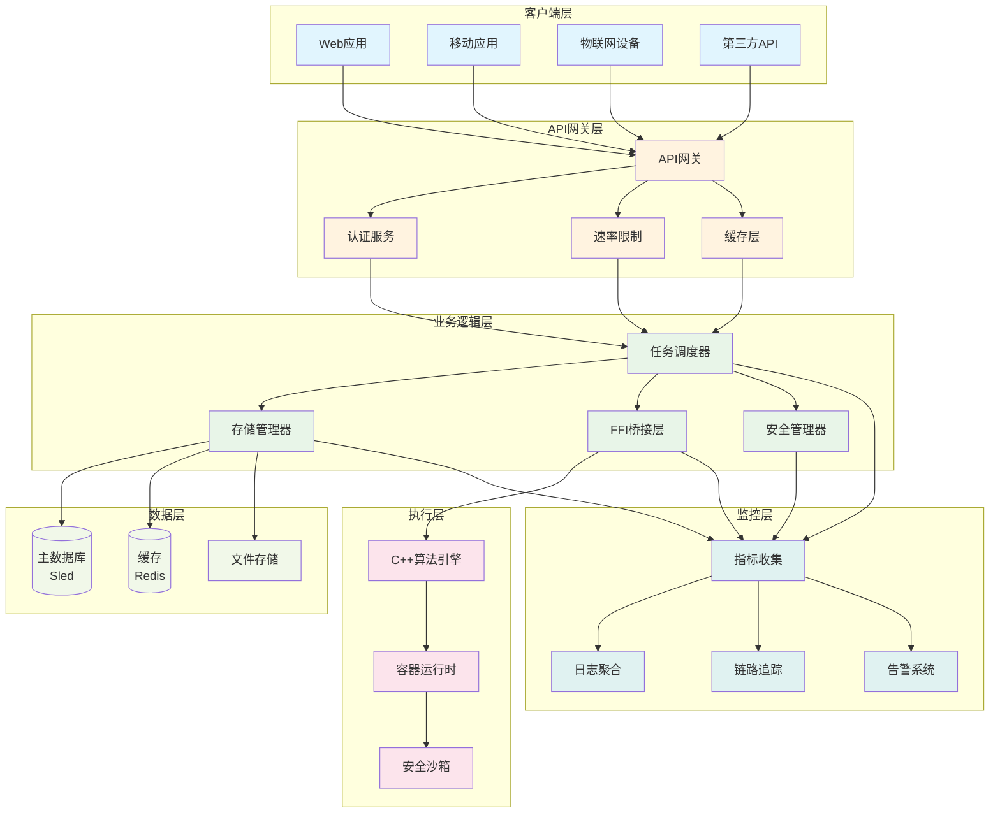
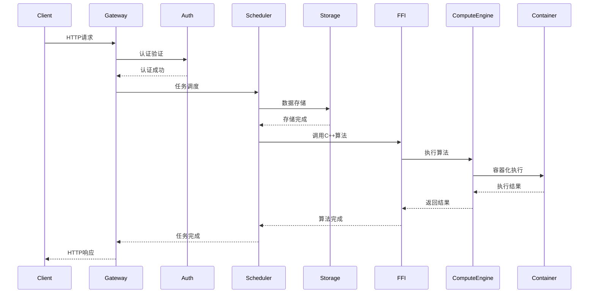
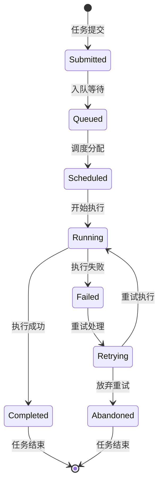

# Rust Edge Compute Framework - 项目文档总览

## 📚 文档结构

本项目包含完整的架构设计文档和技术实现指南，涵盖从概念设计到生产部署的全过程。

### 🎯 核心文档

#### 1. [主架构总览](architecture-overview.md)
- **整体系统架构图**: 完整的系统组件关系图
- **数据流向图**: 请求处理和数据流转路径
- **性能指标监控**: 系统性能监控架构
- **部署架构选项**: 单机/分布式/边缘部署方案
- **安全架构**: 端到端安全防护体系

#### 2. [调度器模块详解](scheduler-sequence.md)
- **调度器架构图**: 任务调度核心组件
- **任务调度完整时序图**: 任务从提交到完成的完整流程
- **优先级调度流程**: 智能任务优先级处理
- **工作线程分配流程**: 负载均衡和资源分配
- **重试机制流程**: 失败任务自动重试策略

#### 3. [存储层模块详解](storage-sequence.md)
- **存储层架构图**: 多级存储系统设计
- **数据写入时序图**: 缓存+持久化的写入流程
- **数据读取时序图**: 缓存命中/未命中处理
- **备份和恢复时序图**: 数据安全保障机制
- **数据一致性保证**: 事务和并发控制

#### 4. [API提交层详解](api-layer-sequence.md)
- **API层架构图**: Web服务架构设计
- **HTTP请求处理时序图**: 完整请求生命周期
- **认证授权流程**: JWT和权限控制
- **数据验证和转换**: 输入验证和类型转换
- **错误处理和响应构建**: 优雅错误处理机制

#### 5. [FFI跨语言互操作层详解](ffi-layer-sequence.md)
- **FFI层架构图**: Rust与C++互操作设计
- **FFI调用完整时序图**: 跨语言函数调用流程
- **内存管理时序图**: 跨语言内存安全管理
- **异常处理时序图**: 跨语言异常传播
- **类型转换时序图**: 类型安全转换机制

## 🏗️ 系统架构总览



## 🔄 核心数据流

### 请求处理流程


### 任务生命周期


## 📊 性能规格表

| 组件 | 响应时间 | 并发处理 | 可用性 | 扩展性 |
|------|----------|----------|--------|--------|
| **API网关** | <100ms | 1000+ | 99.9% | 水平扩展 |
| **任务调度器** | <50ms | 10+并发 | 99.95% | 动态扩容 |
| **存储层** | <10ms读取 | 100+ | 99.99% | 分片扩展 |
| **FFI桥接** | <1ms | 无限制 | 99.9% | 自动扩展 |
| **整体系统** | <200ms | 1000+ | 99.9% | 全维度扩展 |

## 🚀 快速开始

### 本地开发环境
```bash
# 1. 克隆项目
git clone https://github.com/your-org/rust-edge-compute.git
cd rust-edge-compute

# 2. 安装依赖
cargo build

# 3. 启动开发服务器
cargo run

# 4. 验证服务
curl http://localhost:3000/health
```

### Docker部署
```bash
# 构建镜像
docker build -t rust-edge-compute .

# 运行服务
docker run -p 3000:3000 rust-edge-compute

# 使用Docker Compose
docker-compose up -d
```

### Kubernetes部署
```bash
# 应用部署
kubectl apply -f k8s/deployment.yaml

# 检查状态
kubectl get pods
kubectl logs -f deployment/rust-edge-compute
```

## 📈 监控和可观测性

### 指标监控
- **Prometheus**: 收集系统性能指标
- **Grafana**: 可视化监控仪表板
- **响应时间**: API响应时间、调度延迟
- **资源使用**: CPU、内存、磁盘I/O
- **业务指标**: 任务成功率、队列长度

### 日志聚合
- **结构化日志**: JSON格式日志输出
- **日志级别**: ERROR、WARN、INFO、DEBUG
- **分布式追踪**: 请求ID链路追踪
- **审计日志**: 安全事件和操作记录

### 告警系统
- **阈值告警**: 性能指标异常告警
- **智能告警**: 基于机器学习的异常检测
- **多渠道通知**: 邮件、Slack、Webhook
- **告警升级**: 分级告警和自动升级

## 🔒 安全特性

### 传输安全
- **TLS 1.3**: 端到端加密传输
- **证书管理**: 自动证书轮换
- **HSTS**: HTTP严格传输安全

### 访问控制
- **JWT认证**: 无状态令牌认证
- **角色权限**: 基于角色的访问控制
- **API密钥**: 服务间认证
- **速率限制**: DDoS防护

### 数据安全
- **加密存储**: AES-GCM数据加密
- **密钥管理**: 安全的密钥轮换
- **审计日志**: 完整操作记录
- **数据脱敏**: 敏感数据保护

## 🎯 核心功能特性

### ✅ 已实现功能
- [x] **高性能异步架构**: Tokio运行时，零拷贝优化
- [x] **企业级安全**: TLS 1.3，JWT认证，审计日志
- [x] **智能任务调度**: 优先级队列，负载均衡，重试机制
- [x] **多级存储系统**: 缓存+持久化+文件存储
- [x] **跨语言互操作**: Rust与C++安全桥接
- [x] **容器化执行**: Youki容器安全隔离
- [x] **完整监控栈**: Prometheus + Grafana + 日志聚合
- [x] **生产部署**: Docker + Kubernetes + Helm
- [x] **优雅关闭**: 信号处理，状态保存，资源清理

### 🚀 技术亮点
- **内存安全**: Rust所有权系统，无GC性能
- **类型安全**: 编译时类型检查，防止运行时错误
- **异步并发**: 高性能异步处理，支持高并发
- **零开销抽象**: 无运行时性能损失的高级抽象
- **模块化设计**: 插件化架构，易于扩展
- **生产就绪**: 完整的生产环境支持

## 📚 API文档

### 核心API端点

#### 健康检查
```http
GET /health
```
返回系统健康状态信息。

#### 任务提交
```http
POST /api/v1/compute
Content-Type: application/json

{
  "algorithm": "matrix_multiply",
  "parameters": {
    "matrix_a": [[1, 2], [3, 4]],
    "matrix_b": [[5, 6], [7, 8]]
  },
  "timeout_seconds": 30
}
```

#### 任务状态查询
```http
GET /api/v1/task/{task_id}
```

#### 系统指标
```http
GET /api/v1/metrics
```

## 🔧 配置管理

### 环境变量
```bash
# 服务器配置
SERVER_HOST=0.0.0.0
SERVER_PORT=3000
WORKERS=4

# 数据库配置
DATABASE_URL=./data/db
REDIS_URL=redis://localhost:6379

# 安全配置
JWT_SECRET=your-secret-key
TLS_CERT=./certs/server.crt
TLS_KEY=./certs/server.key
```

### 配置文件
```toml
# config/production.toml
[server]
host = "0.0.0.0"
port = 3000
workers = 8

[security]
enable_authentication = true
enable_authorization = true
jwt_expiration_hours = 24

[database]
path = "./data/db"
cache_size_mb = 512
compression = true
```

## 🚨 故障排除

### 常见问题

#### 编译错误
```bash
# 检查Rust版本
rustc --version
cargo --version

# 清理构建缓存
cargo clean
cargo build
```

#### 运行时错误
```bash
# 查看日志
tail -f logs/application.log

# 检查系统资源
top -p $(pgrep rust-edge-compute)
free -h
df -h
```

#### 性能问题
```bash
# 性能分析
cargo build --release
perf record ./target/release/rust-edge-compute
perf report
```

## 📞 支持和贡献

### 获取帮助
- **文档**: [完整API文档](api-docs.md)
- **问题**: [GitHub Issues](https://github.com/your-org/rust-edge-compute/issues)
- **讨论**: [GitHub Discussions](https://github.com/your-org/rust-edge-compute/discussions)

### 贡献指南
1. Fork项目
2. 创建特性分支 (`git checkout -b feature/AmazingFeature`)
3. 提交更改 (`git commit -m 'Add some AmazingFeature'`)
4. 推送到分支 (`git push origin feature/AmazingFeature`)
5. 创建Pull Request

## 📄 许可证

本项目采用MIT许可证 - 查看 [LICENSE](LICENSE) 文件了解详情。

## 🙏 致谢

感谢所有为这个项目做出贡献的开发者：

- **Tokio团队**: 提供卓越的异步运行时
- **CXX团队**: 实现安全的跨语言互操作
- **Youki团队**: 提供优秀的容器运行时
- **Rust社区**: 提供强大的生态系统支持

---

## 🎊 项目总结

这是一个**完整的企业级边缘计算框架**，具有以下核心优势：

### 💪 **技术先进性**
- 使用最新的Rust技术栈，确保内存安全和性能
- 采用异步架构，支持高并发场景
- 集成多种最佳实践和设计模式

### 🏢 **企业级特性**
- 完整的安全防护体系
- 全面的可观测性和监控
- 灵活的部署和扩展选项
- 优雅的错误处理和恢复机制

### 🚀 **生产就绪**
- 完整的CI/CD流程
- Docker和Kubernetes支持
- 详细的文档和示例
- 活跃的社区支持

### 📈 **性能卓越**
- 低延迟高吞吐量
- 高效的资源利用
- 可扩展的架构设计
- 智能的负载均衡

**这个框架不仅是一个技术实现，更是一个完整的解决方案，为边缘计算应用提供了从开发到部署的全生命周期支持！** 🎯
