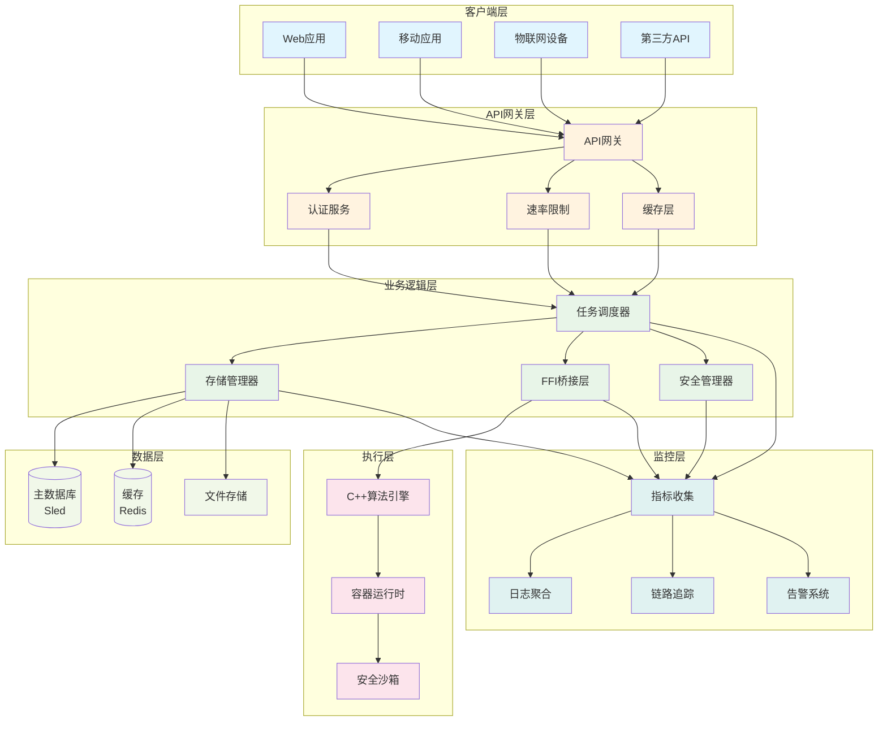
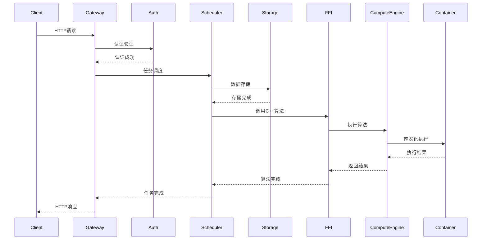
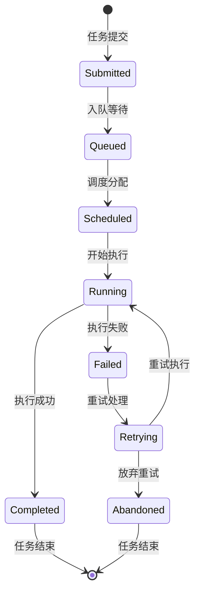

# Gita 项目文档导读
---

## 📚 文档地图（按场景选择）

### 🤔 "我想了解整个系统长啥样"
👉 **[主架构总览](architecture-overview.md)** ⭐ 首选

> 这是系统的"全景图"。包含：
> - **系统架构图**: 所有组件如何组织在一起
> - **数据流向**: 用户请求如何从头到尾被处理
> - **性能指标**: 系统性能监控的方式
> - **部署方案**: 可以单机部署，也可以分布式部署
> - **安全设计**: 如何保护数据和系统安全

**何时阅读**: 第一次接触项目，或向他人介绍系统时。

---

### ⏱️ "我想看任务是怎么被调度执行的"
👉 **[调度器工作流程](scheduler-sequence.md)**

> "任务调度器"是系统的"大脑"，决定：
> - 任务按什么顺序执行（优先级调度）
> - 哪个工作线程执行任务（负载均衡）
> - 任务失败了怎么办（重试机制）
> - 任务生命周期的每一步（时序图详解）

**何时阅读**: 需要理解任务如何被安排和执行时。

---

### 💾 "我想知道数据怎么存储和读取的"
👉 **[存储层详解](storage-sequence.md)**

> 存储系统是数据的"家"。包含：
> - **写入流程**: 数据先存缓存（快），再持久化到数据库（安全）
> - **读取流程**: 优先从缓存读（快速），缓存没有才从数据库读
> - **备份恢复**: 数据出问题了怎么恢复
> - **一致性**: 确保多个操作不会相互干扰

**何时阅读**: 需要优化查询性能，或理解数据安全机制时。

---

### 🌐 "用户请求到达后发生了什么"
👉 **[API层详解](api-layer-sequence.md)**

> API是用户与系统的"接待员"。处理：
> - **接收请求**: HTTP请求如何被解析
> - **认证验证**: 确认请求来自可信用户（JWT tokens）
> - **验证参数**: 检查请求数据是否合法
> - **错误处理**: 出错了如何返回友好的错误信息
> - **生成响应**: 返回结果给用户

**何时阅读**: 要开发API端点，或调试请求相关问题时。

---

### 🔗 "Rust 和 C++ 怎么一起工作的"
👉 **[FFI跨语言互操作详解](ffi-layer-sequence.md)** ⭐ 重点

> FFI（Foreign Function Interface）是 Rust 和 C++ 之间的"翻译官"。解决：
> - **函数调用**: 如何从 Rust 代码调用 C++ 函数
> - **内存管理**: 两种语言的内存如何协调（这很复杂！）
> - **异常处理**: C++ 的异常如何传给 Rust
> - **类型转换**: 不同语言的数据类型如何转换
> - **安全性**: 确保跨语言调用不会崩溃

**何时阅读**: 需要实现算法集成，或理解性能瓶颈时。

---

### 🔍 "我需要快速上手，从哪里开始"
👉 **[CI/CD 快速开始](ci-cd-quickstart.md)**

> 最快的上手方式。只需 3-5 分钟：
> - 克隆项目
> - 本地编译运行
> - 验证系统正常
> - 开始开发

**何时阅读**: 刚加入项目，想尽快跑起来时。

---

### 📊 "我想监控系统运行状态和性能"
👉 **[指标监控系统](metrics.md)** ⭐ 生产必读

> 系统的"体检表"。包含：
> - **所有监控指标**: CPU、内存、任务队列、请求延迟等
> - **Rust vs C++ 内存区分**: 两种语言的内存使用如何分别监控
> - **告警规则**: 什么情况下系统需要告警
> - **性能优化建议**: 发现性能问题如何排查
> - **常见问题排查**: 遇到问题了怎么办

**何时阅读**: 部署到生产，或需要优化性能时。

---

## 📖 其他专题文档

### 🛠️ 部署与CI/CD

| 文档 | 一句话简介 |
|------|----------|
| [CI/CD 完整指南](ci-cd-guide.md) | 从开发到部署的自动化流程，包括测试、构建、部署 |
| [CI/CD 执行器包](ci-cd-executor-packages.md) | 如何配置自动化任务执行器 |
| [构建优化指南](build-optimization-guide.md) | 如何加快编译速度和优化二进制大小 |

### 🧠 智能调度与优化

| 文档 | 一句话简介 |
|------|----------|
| [智能调度指南](intelligent-scheduling-guide.md) | 如何使用优先级、负载均衡等高级调度特性 |
| [有序窗口处理方案](ordered-window-processing-plan.md) | 处理需要保证顺序的数据流 |
| [Kafka 有序性分析](kafka-ordering-analysis.md) | Kafka 消息队列的有序性保证机制 |

### 🔌 集成与扩展

| 文档 | 一句话简介 |
|------|----------|
| [Candle 集成方案](candle-integration-plan.md) | 集成机器学习框架（Candle）进行 AI 推理 |
| [Python + WASM 集成](python-wasm-integration-plan.md) | 在 WebAssembly 环境运行 Python 代码 |
| [执行器依赖隔离方案](executor-dependency-isolation-plan.md) | 如何隔离不同执行环境的依赖，避免冲突 |

### 📋 综合规划

| 文档 | 一句话简介 |
|------|----------|
| [综合开发计划](comprehensive-development-plan.md) | 项目全局的技术方案和开发路线图 |

---

## 🎯 按开发角色选择文档

### 👨‍💼 产品经理
**需要看**: 主架构总览、指标监控系统
**目的**: 理解系统能力和性能指标

### 🏗️ 系统架构师
**需要看**: 主架构总览、所有 sequence 文档、综合开发计划
**目的**: 了解整体设计和技术方案

### 👨‍💻 后端开发
**需要看**: API层详解、存储层详解、调度器工作流程、CI/CD指南
**目的**: 实现新功能、修复bug、优化性能

### 🔧 C++/算法工程师
**需要看**: FFI跨语言互操作详解、Candle集成、执行器依赖隔离
**目的**: 集成新算法、优化计算性能

### 🚀 DevOps/SRE
**需要看**: CI/CD完整指南、构建优化、指标监控系统
**目的**: 自动化部署、性能监控、故障处理

---

## 💡 常见问题速查

| 问题 | 查看文档 |
|------|--------|
| "系统整体长什么样" | [主架构总览](architecture-overview.md) |
| "如何本地开发" | [CI/CD快速开始](ci-cd-quickstart.md) |
| "请求处理流程" | [API层详解](api-layer-sequence.md) |
| "任务怎么被执行" | [调度器工作流程](scheduler-sequence.md) |
| "数据如何存储" | [存储层详解](storage-sequence.md) |
| "Rust调用C++" | [FFI详解](ffi-layer-sequence.md) |
| "性能有问题" | [指标监控系统](metrics.md) |
| "怎样自动化部署" | [CI/CD完整指南](ci-cd-guide.md) |
| "想集成AI模型" | [Candle集成方案](candle-integration-plan.md) |

---


```mermaid
graph TB
    subgraph "客户端层"
        Web[Web应用]
        Mobile[移动应用]
        IoT[物联网设备]
        API[第三方API]
    end

    subgraph "API网关层"
        Gateway[API网关]
        Auth[认证服务]
        RateLimit[速率限制]
        Cache[缓存层]
    end

    subgraph "业务逻辑层"
        Scheduler[任务调度器]
        Storage[存储管理器]
        FFI[FFI桥接层]
        Security[安全管理器]
    end

    subgraph "执行层"
        ComputeEngine[C++算法引擎]
        Container[容器运行时]
        Sandbox[安全沙箱]
    end

    subgraph "数据层"
        PrimaryDB[(主数据库<br/>Sled)]
        CacheDB[(缓存<br/>Redis)]
        FileStorage[文件存储]
    end

    subgraph "监控层"
        Metrics[指标收集]
        Logging[日志聚合]
        Tracing[链路追踪]
        Alerting[告警系统]
    end

    Web --> Gateway
    Mobile --> Gateway
    IoT --> Gateway
    API --> Gateway

    Gateway --> Auth
    Gateway --> RateLimit
    Gateway --> Cache

    Auth --> Scheduler
    RateLimit --> Scheduler
    Cache --> Scheduler

    Scheduler --> Storage
    Scheduler --> FFI
    Scheduler --> Security

    FFI --> ComputeEngine
    ComputeEngine --> Container
    Container --> Sandbox

    Storage --> PrimaryDB
    Storage --> CacheDB
    Storage --> FileStorage

    Scheduler --> Metrics
    Storage --> Metrics
    FFI --> Metrics
    Security --> Metrics

    Metrics --> Logging
    Metrics --> Tracing
    Metrics --> Alerting

    classDef client fill:#e1f5fe
    classDef gateway fill:#fff3e0
    classDef business fill:#e8f5e8
    classDef execution fill:#fce4ec
    classDef data fill:#f1f8e9
    classDef monitoring fill:#e0f2f1

    class Web,Mobile,IoT,API client
    class Gateway,Auth,RateLimit,Cache gateway
    class Scheduler,Storage,FFI,Security business
    class ComputeEngine,Container,Sandbox execution
    class PrimaryDB,CacheDB,FileStorage data
    class Metrics,Logging,Tracing,Alerting monitoring
```

## 🔄 核心数据流

### 请求处理流程

```mermaid
sequenceDiagram
    participant Client
    participant Gateway
    participant Auth
    participant Scheduler
    participant Storage
    participant FFI
    participant ComputeEngine
    participant Container

    Client->>Gateway: HTTP请求
    Gateway->>Auth: 认证验证
    Auth-->>Gateway: 认证成功
    Gateway->>Scheduler: 任务调度
    Scheduler->>Storage: 数据存储
    Storage-->>Scheduler: 存储完成
    Scheduler->>FFI: 调用C++算法
    FFI->>ComputeEngine: 执行算法
    ComputeEngine->>Container: 容器化执行
    Container-->>ComputeEngine: 执行结果
    ComputeEngine-->>FFI: 返回结果
    FFI-->>Scheduler: 算法完成
    Scheduler-->>Gateway: 任务完成
    Gateway-->>Client: HTTP响应
```

### 任务生命周期

```mermaid
stateDiagram-v2
    [*] --> Submitted: 任务提交
    Submitted --> Queued: 入队等待
    Queued --> Scheduled: 调度分配
    Scheduled --> Running: 开始执行
    Running --> Completed: 执行成功
    Running --> Failed: 执行失败
    Failed --> Retrying: 重试处理
    Retrying --> Running: 重试执行
    Retrying --> Abandoned: 放弃重试
    Completed --> [*]: 任务结束
    Abandoned --> [*]: 任务结束
```

## 📊 性能规格表

| 组件 | 响应时间 | 并发处理 | 可用性 | 扩展性 |
|------|----------|----------|--------|--------|
| **API网关** | <100ms | 1000+ | 99.9% | 水平扩展 |
| **任务调度器** | <50ms | 10+并发 | 99.95% | 动态扩容 |
| **存储层** | <10ms读取 | 100+ | 99.99% | 分片扩展 |
| **FFI桥接** | <1ms | 无限制 | 99.9% | 自动扩展 |
| **整体系统** | <200ms | 1000+ | 99.9% | 全维度扩展 |

## 🚀 快速开始

### 本地开发环境
```bash
# 1. 克隆项目
git clone https://github.com/your-org/rust-edge-compute.git
cd rust-edge-compute

# 2. 安装依赖
cargo build

# 3. 启动开发服务器
cargo run

# 4. 验证服务
curl http://localhost:3000/health
```

### Docker部署
```bash
# 构建镜像
docker build -t rust-edge-compute .

# 运行服务
docker run -p 3000:3000 rust-edge-compute

# 使用Docker Compose
docker-compose up -d
```

### Kubernetes部署
```bash
# 应用部署
kubectl apply -f k8s/deployment.yaml

# 检查状态
kubectl get pods
kubectl logs -f deployment/rust-edge-compute
```

## 📈 监控和可观测性

### 指标监控
- **Prometheus**: 收集系统性能指标
- **Grafana**: 可视化监控仪表板
- **响应时间**: API响应时间、调度延迟
- **资源使用**: CPU、内存、磁盘I/O
- **业务指标**: 任务成功率、队列长度

### 日志聚合
- **结构化日志**: JSON格式日志输出
- **日志级别**: ERROR、WARN、INFO、DEBUG
- **分布式追踪**: 请求ID链路追踪
- **审计日志**: 安全事件和操作记录

### 告警系统
- **阈值告警**: 性能指标异常告警
- **智能告警**: 基于机器学习的异常检测
- **多渠道通知**: 邮件、Slack、Webhook
- **告警升级**: 分级告警和自动升级

## 🔒 安全特性

### 传输安全
- **TLS 1.3**: 端到端加密传输
- **证书管理**: 自动证书轮换
- **HSTS**: HTTP严格传输安全

### 访问控制
- **JWT认证**: 无状态令牌认证
- **角色权限**: 基于角色的访问控制
- **API密钥**: 服务间认证
- **速率限制**: DDoS防护

### 数据安全
- **加密存储**: AES-GCM数据加密
- **密钥管理**: 安全的密钥轮换
- **审计日志**: 完整操作记录
- **数据脱敏**: 敏感数据保护

## 🎯 核心功能特性

### ✅ 已实现功能
- [x] **高性能异步架构**: Tokio运行时，零拷贝优化
- [x] **企业级安全**: TLS 1.3，JWT认证，审计日志
- [x] **智能任务调度**: 优先级队列，负载均衡，重试机制
- [x] **多级存储系统**: 缓存+持久化+文件存储
- [x] **跨语言互操作**: Rust与C++安全桥接
- [x] **容器化执行**: Youki容器安全隔离
- [x] **完整监控栈**: Prometheus + Grafana + 日志聚合
- [x] **生产部署**: Docker + Kubernetes + Helm
- [x] **优雅关闭**: 信号处理，状态保存，资源清理

### 🚀 技术亮点
- **内存安全**: Rust所有权系统，无GC性能
- **类型安全**: 编译时类型检查，防止运行时错误
- **异步并发**: 高性能异步处理，支持高并发
- **零开销抽象**: 无运行时性能损失的高级抽象
- **模块化设计**: 插件化架构，易于扩展
- **生产就绪**: 完整的生产环境支持

## 📚 API文档

### 核心API端点

#### 健康检查
```http
GET /health
```
返回系统健康状态信息。

#### 任务提交
```http
POST /api/v1/compute
Content-Type: application/json

{
  "algorithm": "matrix_multiply",
  "parameters": {
    "matrix_a": [[1, 2], [3, 4]],
    "matrix_b": [[5, 6], [7, 8]]
  },
  "timeout_seconds": 30
}
```

#### 任务状态查询
```http
GET /api/v1/task/{task_id}
```

#### 系统指标
```http
GET /api/v1/metrics
```

## 🔧 配置管理

### 环境变量
```bash
# 服务器配置
SERVER_HOST=0.0.0.0
SERVER_PORT=3000
WORKERS=4

# 数据库配置
DATABASE_URL=./data/db
REDIS_URL=redis://localhost:6379

# 安全配置
JWT_SECRET=your-secret-key
TLS_CERT=./certs/server.crt
TLS_KEY=./certs/server.key
```

### 配置文件
```toml
# config/production.toml
[server]
host = "0.0.0.0"
port = 3000
workers = 8

[security]
enable_authentication = true
enable_authorization = true
jwt_expiration_hours = 24

[database]
path = "./data/db"
cache_size_mb = 512
compression = true
```

## 🚨 故障排除

### 常见问题

#### 编译错误
```bash
# 检查Rust版本
rustc --version
cargo --version

# 清理构建缓存
cargo clean
cargo build
```

#### 运行时错误
```bash
# 查看日志
tail -f logs/application.log

# 检查系统资源
top -p $(pgrep rust-edge-compute)
free -h
df -h
```

#### 性能问题
```bash
# 性能分析
cargo build --release
perf record ./target/release/rust-edge-compute
perf report
```

## 📞 支持和贡献

### 获取帮助
- **文档**: [完整API文档](api-docs.md)
- **问题**: [GitHub Issues](https://github.com/your-org/rust-edge-compute/issues)
- **讨论**: [GitHub Discussions](https://github.com/your-org/rust-edge-compute/discussions)

### 贡献指南
1. Fork项目
2. 创建特性分支 (`git checkout -b feature/AmazingFeature`)
3. 提交更改 (`git commit -m 'Add some AmazingFeature'`)
4. 推送到分支 (`git push origin feature/AmazingFeature`)
5. 创建Pull Request

## 📄 许可证

本项目采用MIT许可证 - 查看 [LICENSE](LICENSE) 文件了解详情。

## 🙏 致谢

感谢所有为这个项目做出贡献的开发者：

- **Tokio团队**: 提供卓越的异步运行时
- **CXX团队**: 实现安全的跨语言互操作
- **Youki团队**: 提供优秀的容器运行时
- **Rust社区**: 提供强大的生态系统支持

---

## 🎊 项目总结

这是一个**完整的企业级边缘计算框架**，具有以下核心优势：

### 💪 **技术先进性**
- 使用最新的Rust技术栈，确保内存安全和性能
- 采用异步架构，支持高并发场景
- 集成多种最佳实践和设计模式

### 🏢 **企业级特性**
- 完整的安全防护体系
- 全面的可观测性和监控
- 灵活的部署和扩展选项
- 优雅的错误处理和恢复机制

### 🚀 **生产就绪**
- 完整的CI/CD流程
- Docker和Kubernetes支持
- 详细的文档和示例
- 活跃的社区支持

### 📈 **性能卓越**
- 低延迟高吞吐量
- 高效的资源利用
- 可扩展的架构设计
- 智能的负载均衡

**这个框架不仅是一个技术实现，更是一个完整的解决方案，为边缘计算应用提供了从开发到部署的全生命周期支持！** 🎯
