# API提交层 - 交互时序图详解

## 🎯 API层架构图

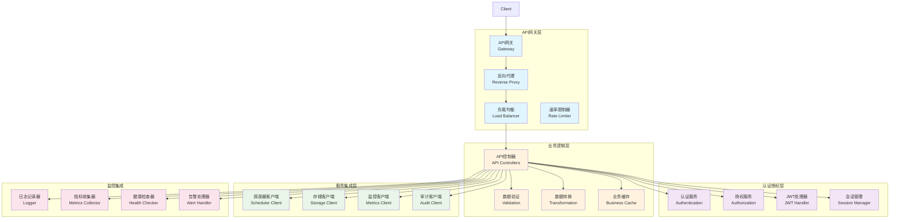

## 🔄 API请求处理完整时序图

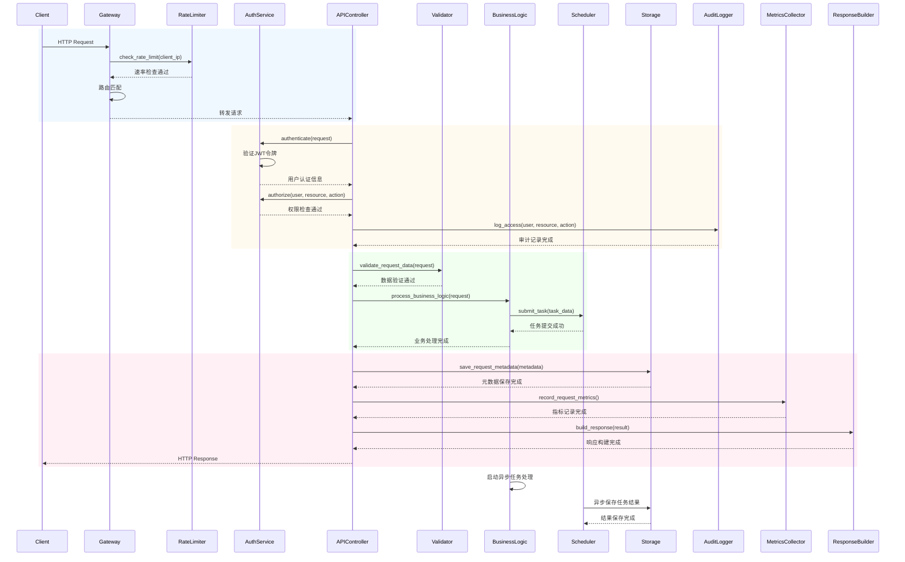

## 📋 详细API处理时序分析

### 1. HTTP请求生命周期时序图

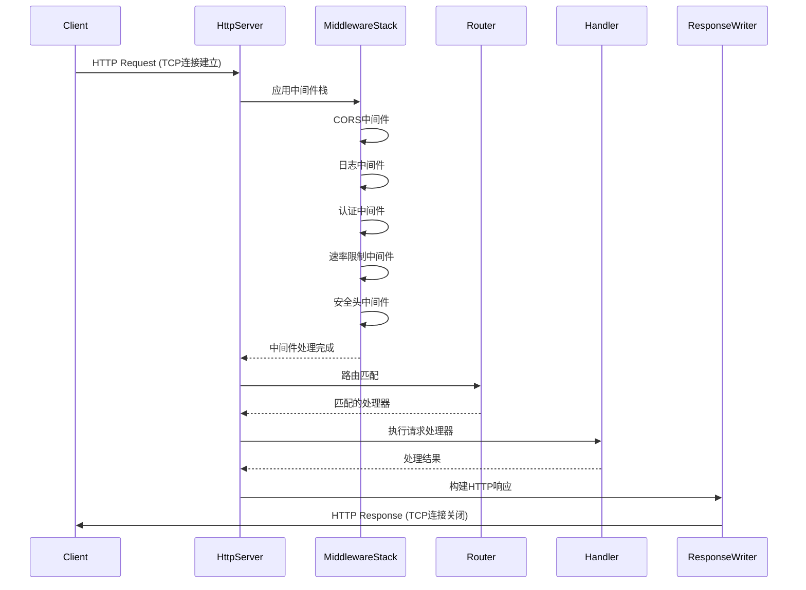

### 2. 认证授权流程时序图

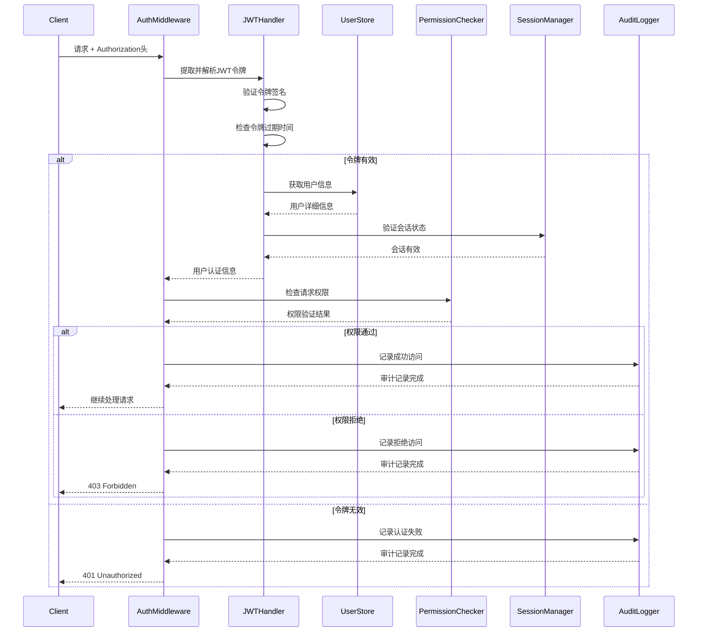

### 3. 数据验证和转换时序图

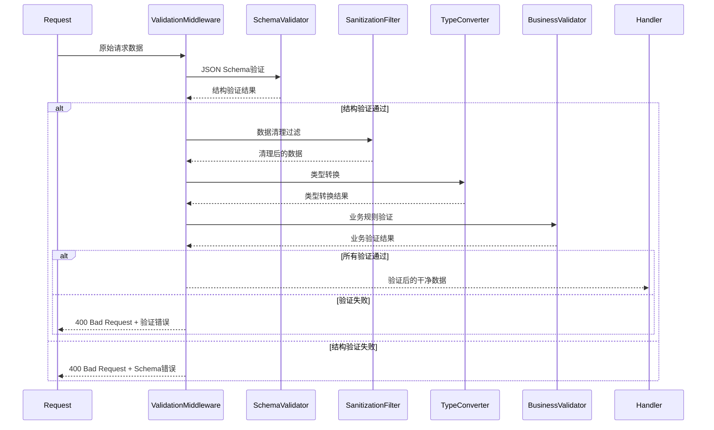

### 4. 错误处理和响应构建时序图

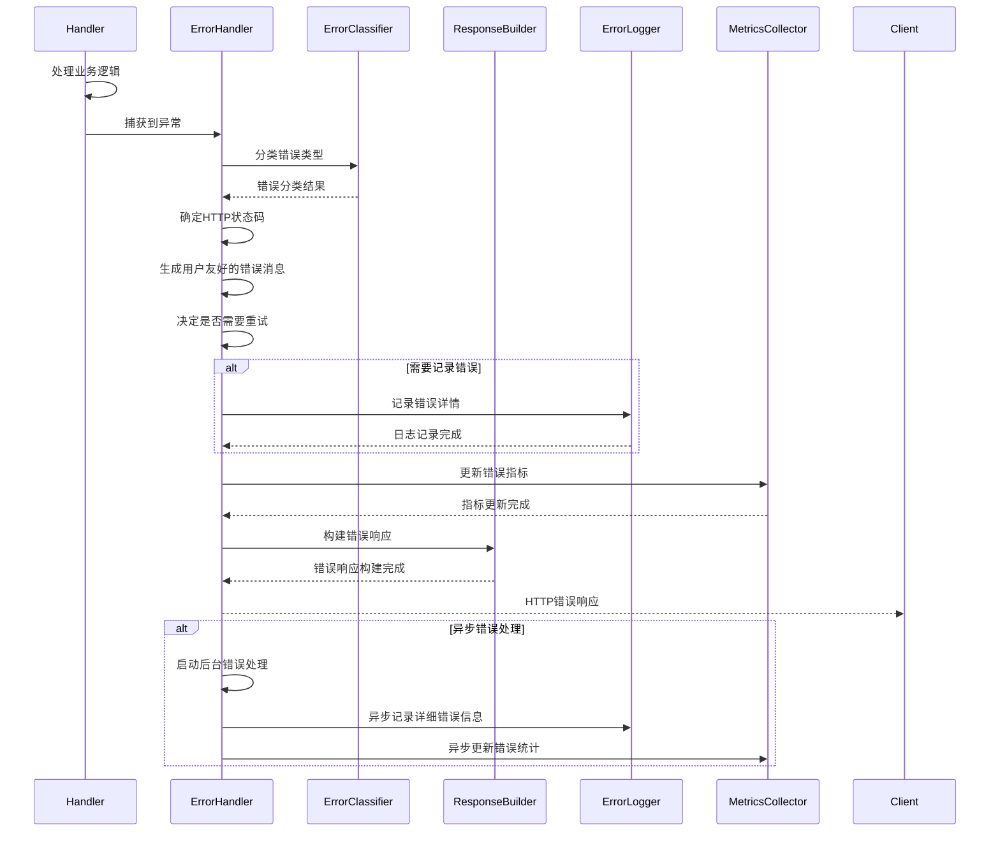

### 5. 缓存处理时序图

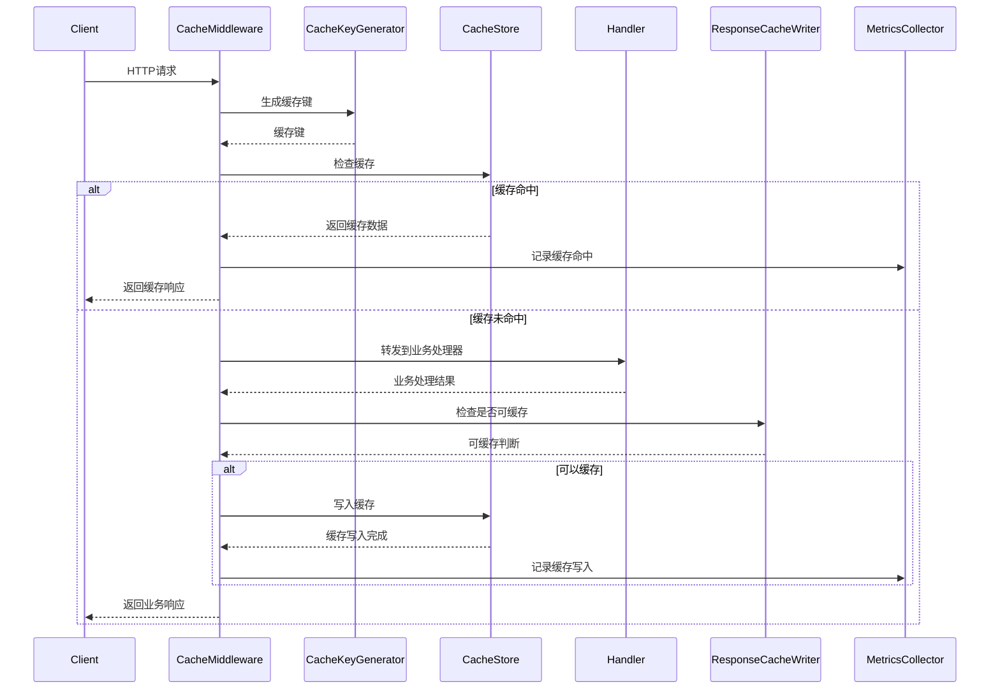

## 📊 API层性能指标

### 请求处理指标
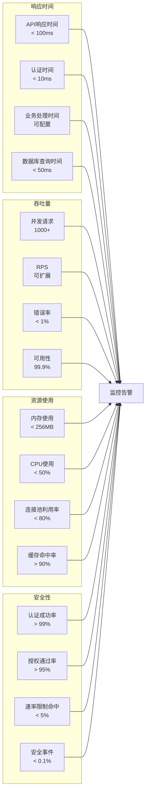

### API健康检查
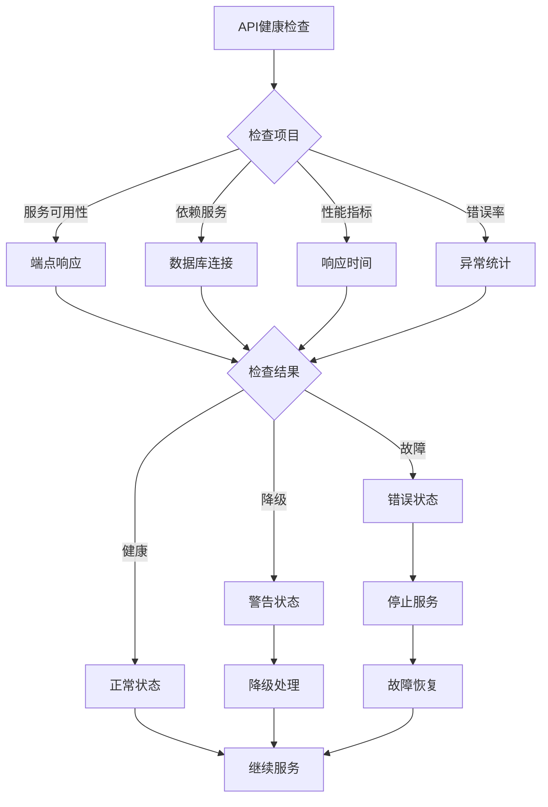

## 🔧 API配置参数

### HTTP服务器配置
```toml
[server.http]
host = "0.0.0.0"
port = 3000
workers = 4
max_connections = 1000
keep_alive_timeout_seconds = 60
request_timeout_seconds = 30
shutdown_timeout_seconds = 30

[server.http.tls]
enabled = true
cert_file = "./certs/server.crt"
key_file = "./certs/server.key"
min_tls_version = "TLS1.2"
```

### 中间件配置
```toml
[middleware.cors]
enabled = true
allowed_origins = ["https://your-domain.com"]
allowed_methods = ["GET", "POST", "PUT", "DELETE", "OPTIONS"]
allowed_headers = ["Content-Type", "Authorization", "X-Requested-With"]
max_age_seconds = 86400

[middleware.rate_limit]
enabled = true
requests_per_minute = 100
burst_size = 20
block_duration_seconds = 300

[middleware.auth]
enabled = true
jwt_secret = "CHANGE_THIS_IN_PRODUCTION"
jwt_expiration_hours = 24
refresh_token_expiration_days = 7

[middleware.cache]
enabled = true
default_ttl_seconds = 300
max_cache_size_mb = 100
```

### API路由配置
```toml
[api.routes]
health_check = "/health"
authentication = "/auth"
compute_tasks = "/compute"
task_management = "/task"
scheduler_status = "/scheduler"
system_metrics = "/metrics"
admin_operations = "/admin"

[api.versioning]
enabled = true
default_version = "v1"
supported_versions = ["v1", "v2"]
version_header = "X-API-Version"
```

## 🚨 异常处理策略

### API异常分类
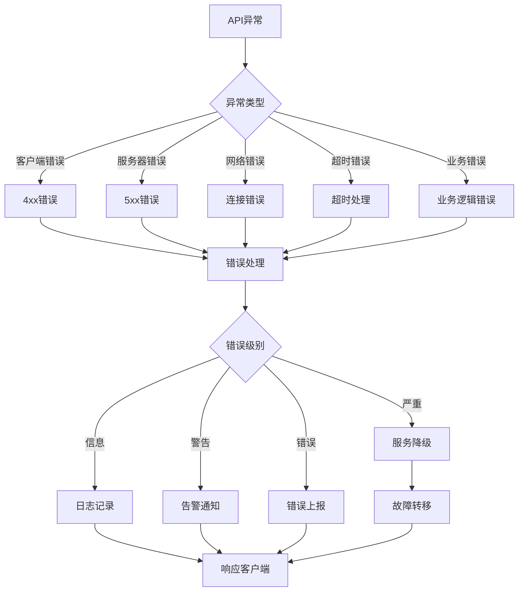

### 错误响应标准化
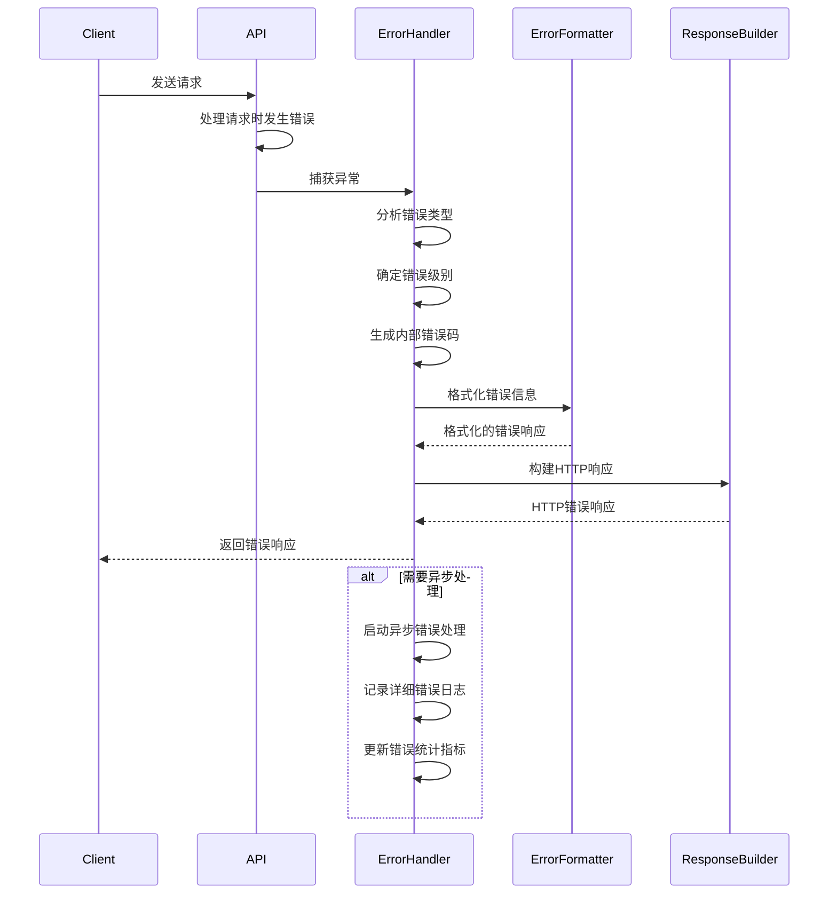

## 📈 API优化策略

### 性能优化
1. **连接优化**: HTTP/2支持，连接复用，keep-alive
2. **缓存优化**: 多级缓存策略，ETag支持，条件请求
3. **并发优化**: 异步处理，工作线程池，负载均衡
4. **序列化优化**: 高效JSON处理，压缩传输

### 安全性优化
1. **输入验证**: 严格的数据验证，XSS防护，SQL注入防护
2. **认证优化**: JWT令牌缓存，多因子认证支持
3. **授权优化**: 权限缓存，细粒度访问控制
4. **加密优化**: TLS 1.3，端到端加密

### 可扩展性优化
1. **API版本控制**: 版本化路由，向后兼容性
2. **插件架构**: 中间件插件化，可扩展功能
3. **服务拆分**: 微服务架构，功能模块化
4. **负载均衡**: 多实例部署，智能路由

### 可观测性优化
1. **请求追踪**: 分布式链路追踪，请求ID关联
2. **性能监控**: 响应时间统计，吞吐量监控
3. **错误追踪**: 错误堆栈跟踪，异常统计
4. **业务指标**: 用户行为分析，业务KPI监控

## 🎯 API层总结

API层是系统的门面和控制中心，提供了以下核心功能：

### ✅ 核心特性
- **RESTful设计**: 标准化的API接口，版本控制
- **安全防护**: 认证授权，速率限制，输入验证
- **高性能**: 异步处理，连接池，缓存优化
- **可观测性**: 完整的监控指标和日志记录
- **错误处理**: 优雅的错误处理和用户友好的响应

### 🚀 技术亮点
- **中间件架构**: 插件化的中间件系统
- **类型安全**: Rust类型系统保证API安全性
- **异步并发**: Tokio异步运行时支持高并发
- **智能缓存**: 多级缓存策略提升性能
- **标准化响应**: 统一的API响应格式

### 📊 性能规格
- **响应时间**: <100ms API响应，<10ms认证
- **并发处理**: 1000+并发连接，支持横向扩展
- **吞吐量**: 可扩展的RPS，支持负载均衡
- **可用性**: 99.9% SLA，智能降级和恢复

### 🔒 安全特性
- **传输安全**: TLS 1.3加密传输
- **认证授权**: JWT + 会话管理 + 权限控制
- **访问控制**: 速率限制 + 输入验证 + XSS防护
- **审计跟踪**: 完整的操作日志和安全事件记录

这个API层提供了企业级的Web服务接口，支持高并发、高可用、高安全性的应用场景。
