# 调度器模块 - 交互时序图详解

## 🎯 调度器架构图

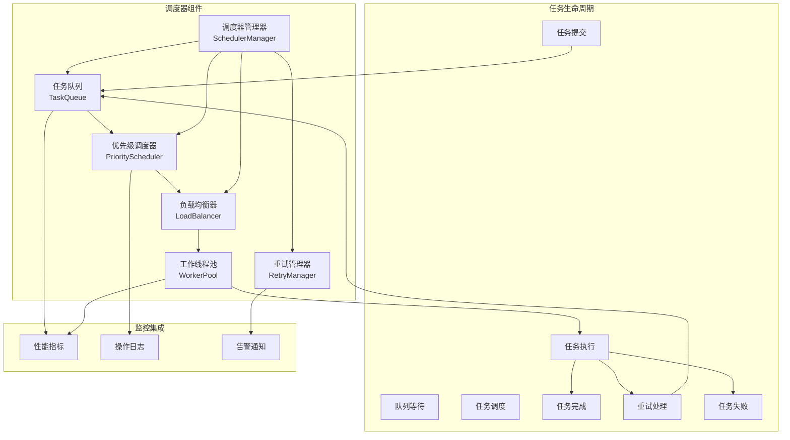

## 🔄 任务调度完整时序图

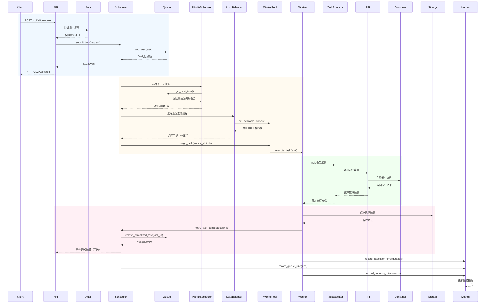

## 📋 详细时序分析

### 1. 任务提交流程

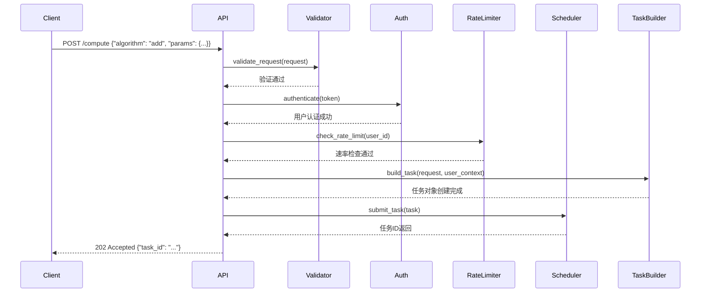

### 2. 优先级调度流程

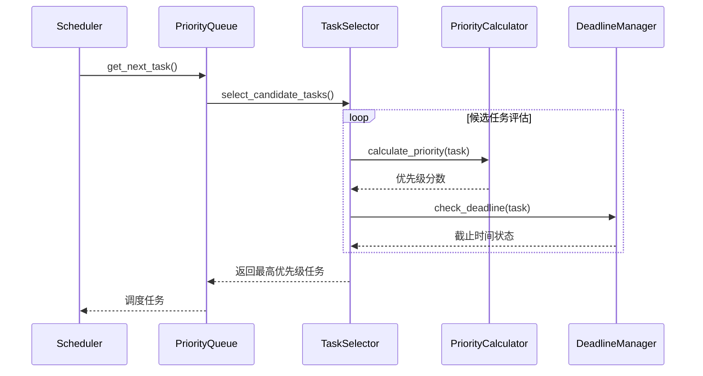

### 3. 工作线程分配流程

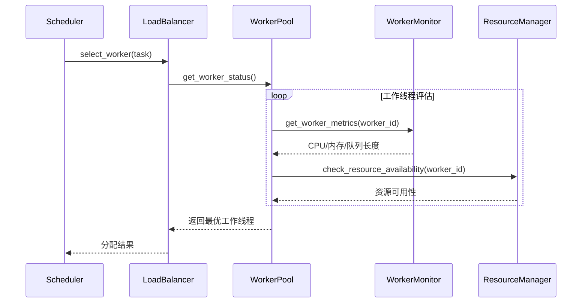

### 4. 任务执行流程

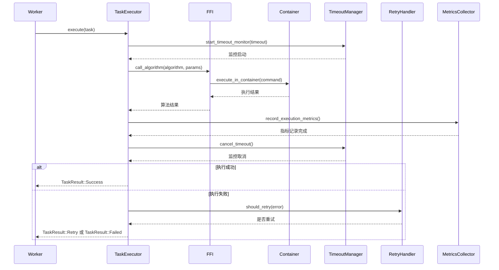

### 5. 重试机制流程

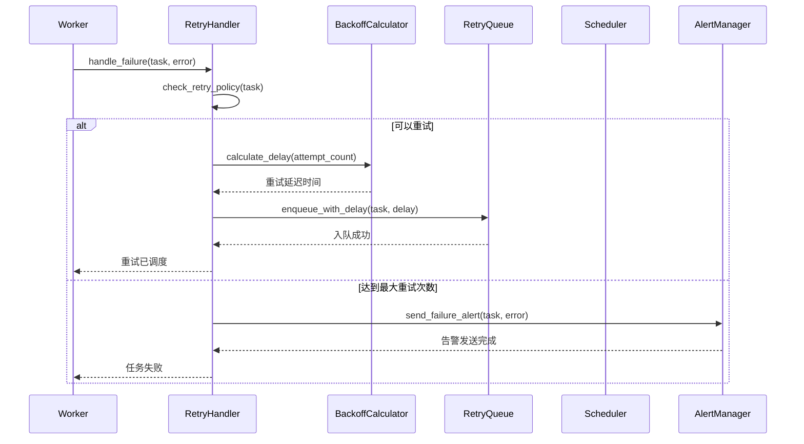

### 6. 负载均衡流程

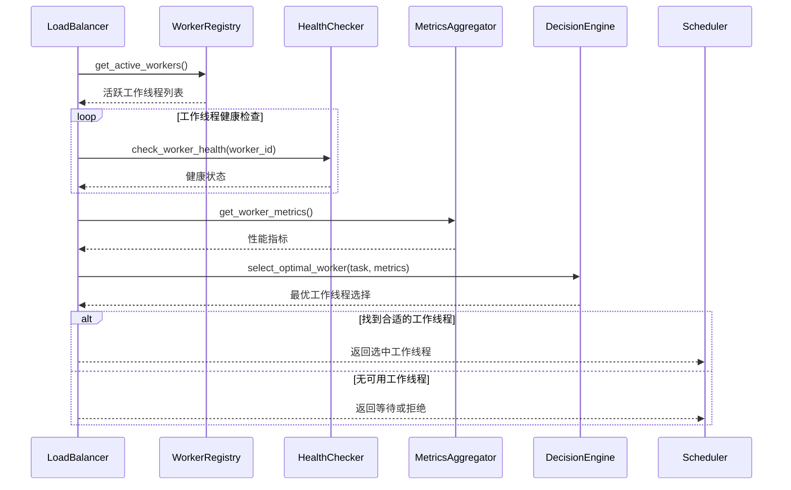

## 📊 调度器性能指标

### 核心指标
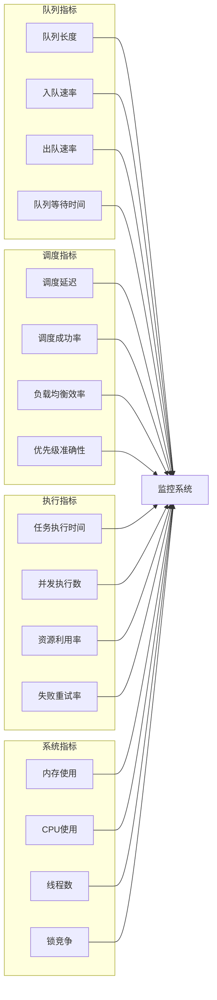

### 性能阈值监控
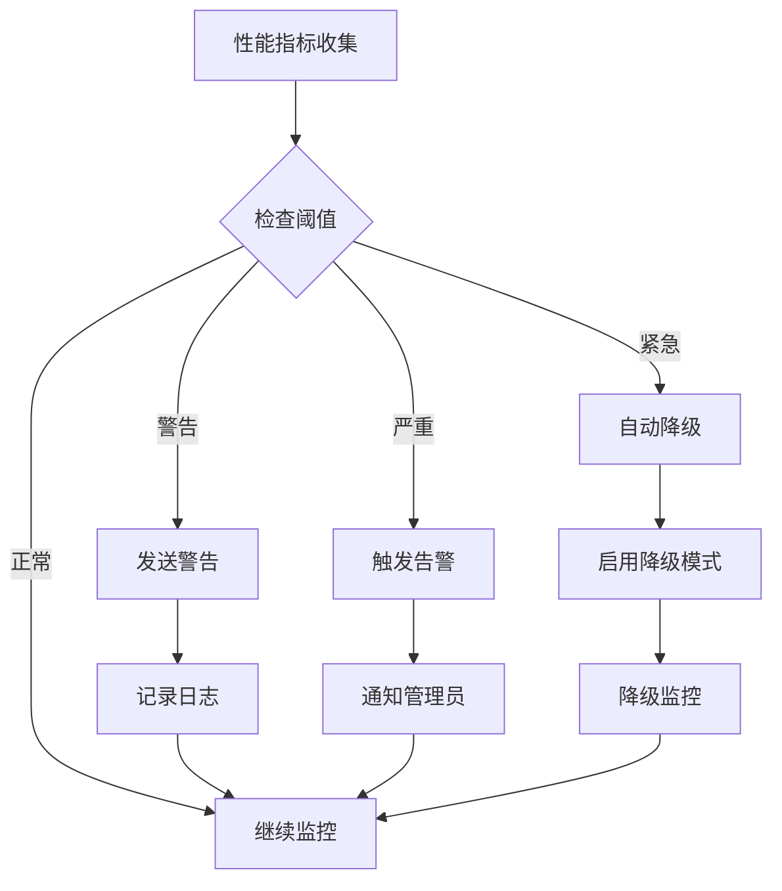

## 🔧 配置参数

### 调度器配置
```toml
[scheduler]
max_concurrent_tasks = 10
queue_size = 1000
task_timeout_seconds = 300
default_max_retries = 3
worker_pool_size = 4
priority_levels = 4
load_balance_strategy = "round_robin"

[scheduler.retry]
max_attempts = 5
initial_delay_ms = 1000
backoff_multiplier = 2.0
max_delay_ms = 30000

[scheduler.priority]
high_threshold = 0.8
medium_threshold = 0.6
low_threshold = 0.3

[scheduler.monitoring]
metrics_interval_ms = 5000
health_check_interval_ms = 30000
alert_threshold_percent = 80
```

### 工作线程配置
```toml
[worker]
max_tasks_per_worker = 100
task_execution_timeout_ms = 300000
resource_check_interval_ms = 1000
health_report_interval_ms = 5000

[worker.resource_limits]
max_memory_mb = 512
max_cpu_percent = 80
max_concurrent_tasks = 5

[worker.metrics]
collect_execution_time = true
collect_resource_usage = true
collect_error_rates = true
export_prometheus = true
```

## 🚨 故障处理

### 常见故障场景
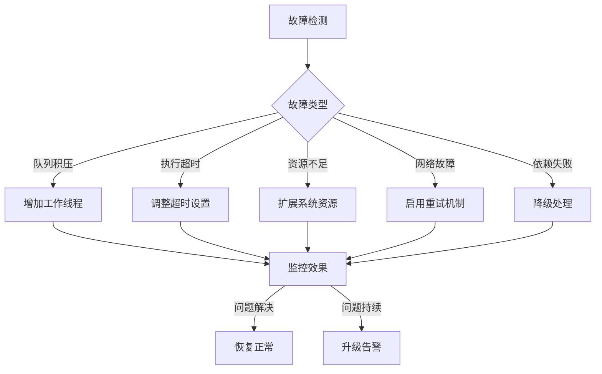

### 自动恢复机制
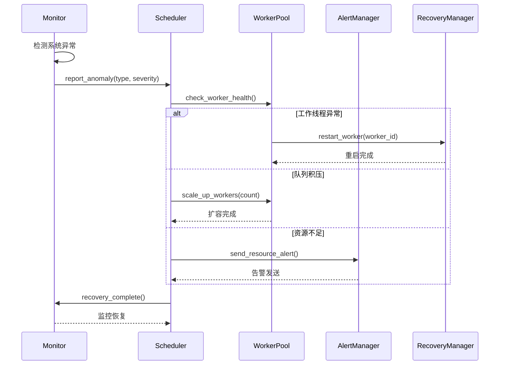

## 📈 优化建议

### 性能优化
1. **并发优化**: 调整工作线程池大小
2. **队列优化**: 实现多级队列和优先级调度
3. **缓存优化**: 添加任务结果缓存
4. **资源优化**: 动态调整资源分配

### 可扩展性优化
1. **分布式调度**: 支持跨节点任务调度
2. **负载均衡**: 实现智能负载均衡算法
3. **故障转移**: 添加故障自动转移机制
4. **配置管理**: 实现动态配置更新

### 可观测性优化
1. **详细指标**: 添加更多性能指标
2. **链路追踪**: 实现分布式链路追踪
3. **日志聚合**: 集中化日志管理
4. **告警规则**: 配置智能告警规则

这个调度器模块提供了完整的任务调度功能，包括优先级调度、负载均衡、重试机制等，是整个系统的核心组件。
