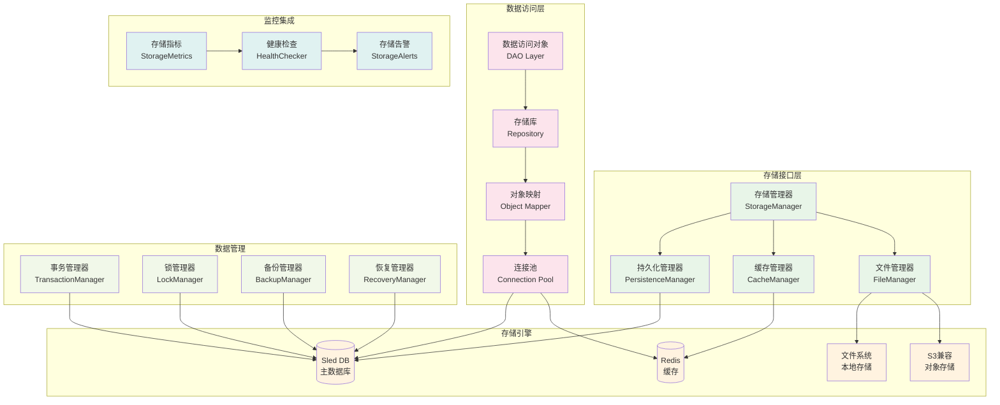
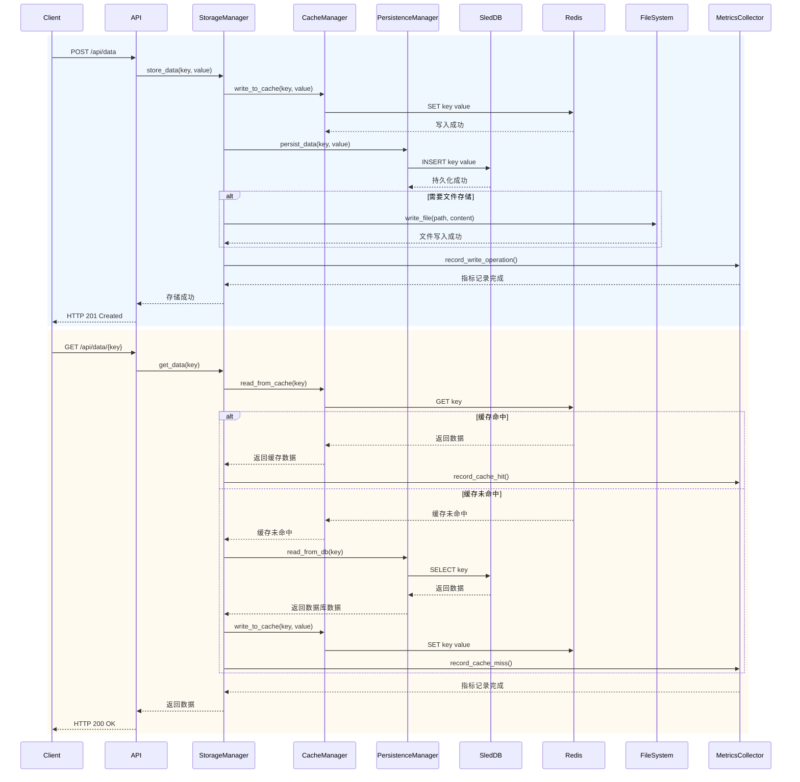
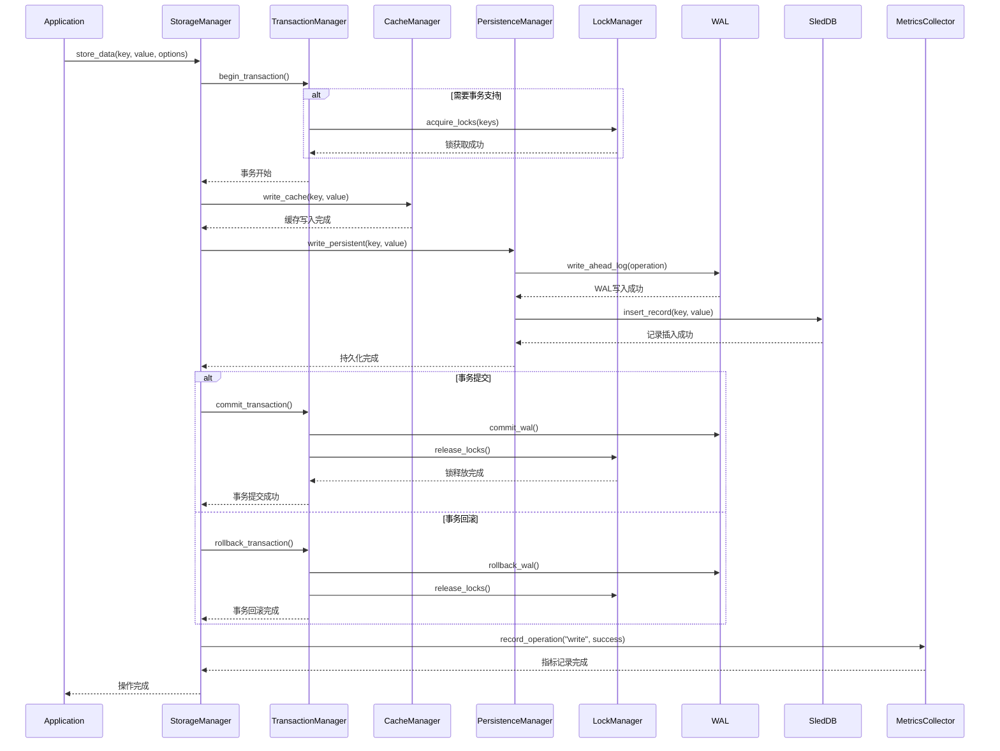
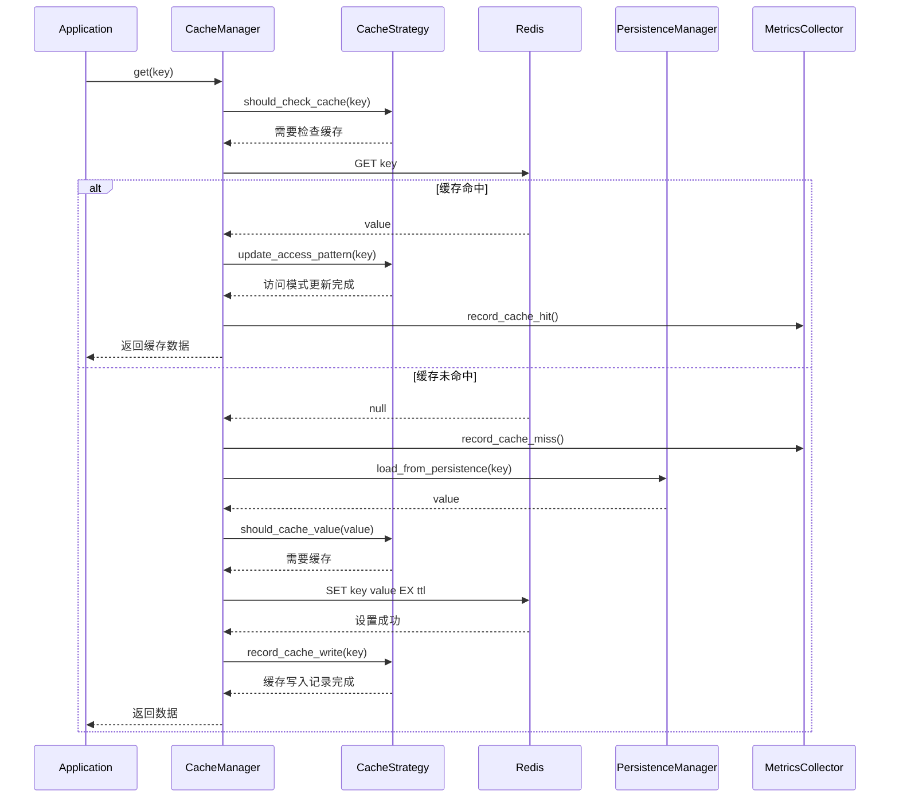
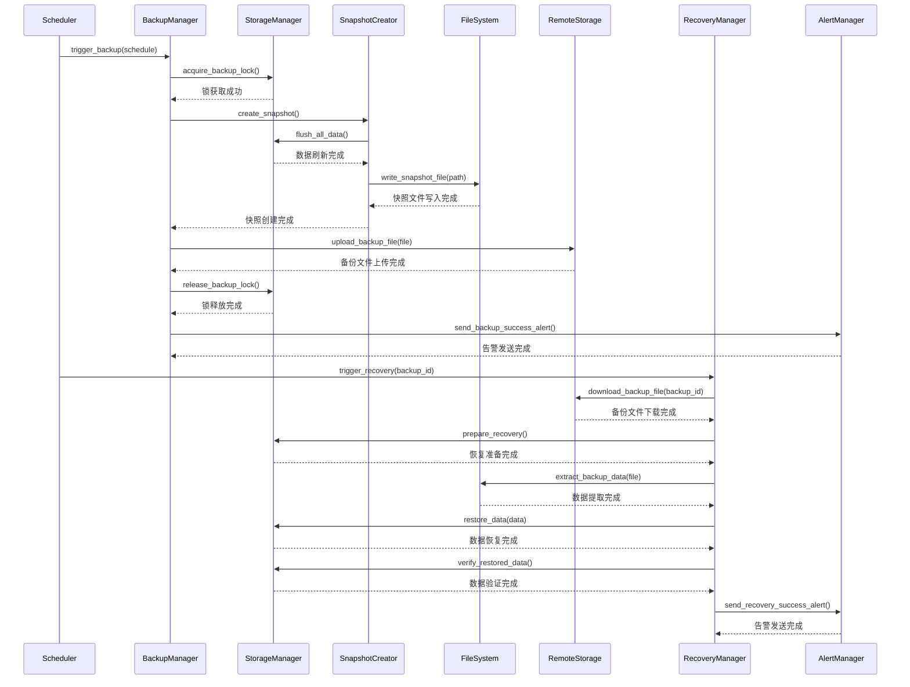
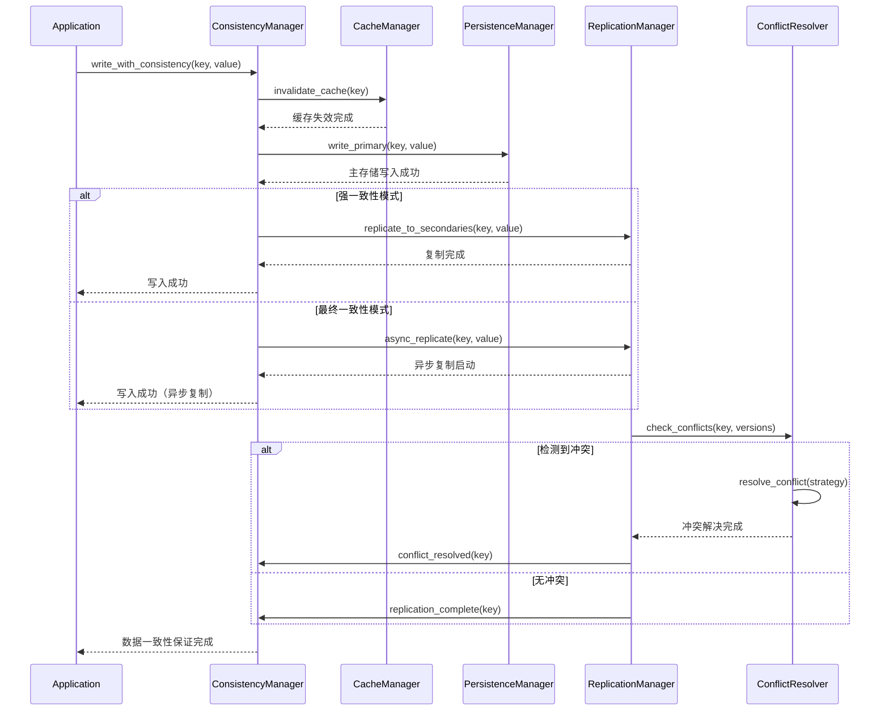
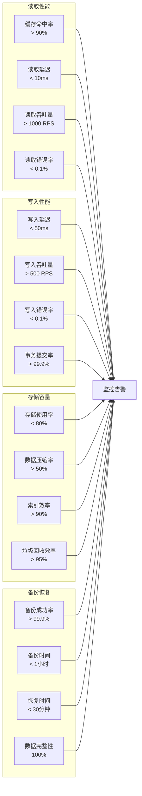
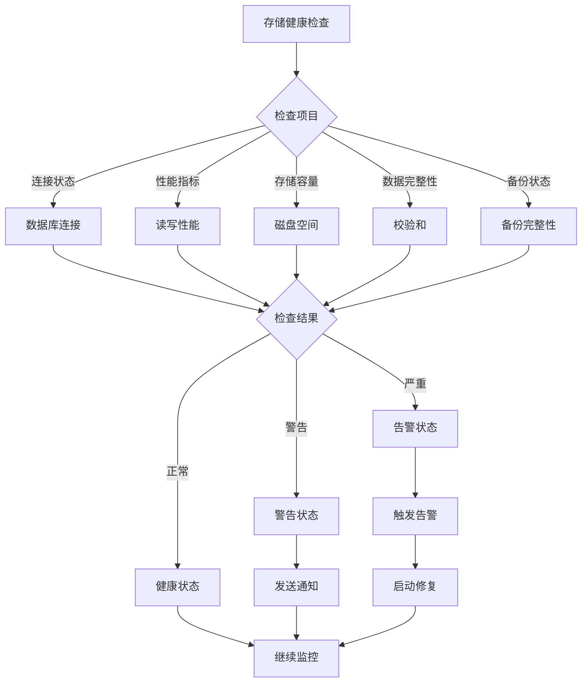
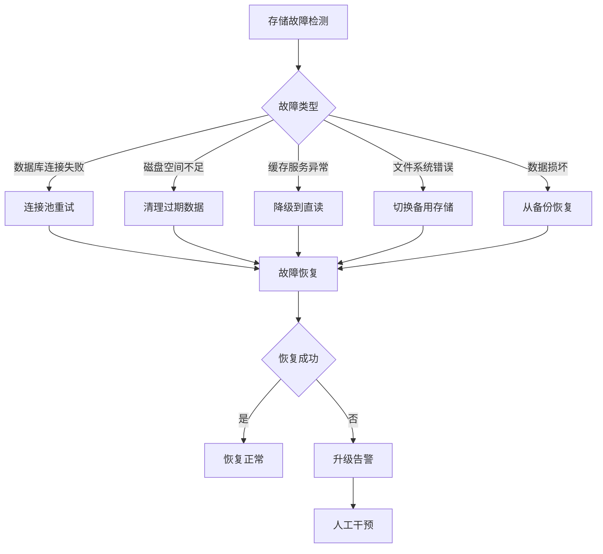
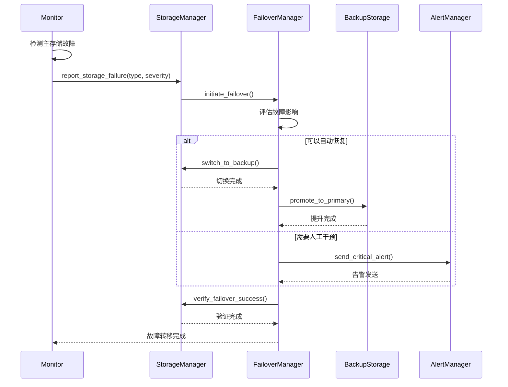

# 存储层模块 - 交互时序图详解

## 🎯 存储层架构图



## 🔄 存储操作完整时序图



## 📋 详细存储操作时序分析

### 1. 数据写入时序图



### 2. 缓存策略时序图



### 3. 备份和恢复时序图



### 4. 数据一致性保证时序图



## 📊 存储层性能指标

### 存储操作指标


### 存储健康检查


## 🔧 存储配置参数

### Sled数据库配置
```toml
[database.sled]
path = "./data/db"
cache_size_mb = 512
compression = true
flush_every_ms = 1000
snapshot_interval_sec = 3600

[database.sled.performance]
max_read_threads = 4
max_write_threads = 2
batch_size = 1000
prefetch_size = 1024
```

### Redis缓存配置
```toml
[cache.redis]
url = "redis://localhost:6379"
connection_pool_size = 10
key_prefix = "rust_edge_compute:"
default_ttl_seconds = 3600

[cache.redis.cluster]
enabled = false
nodes = ["redis://node1:6379", "redis://node2:6379"]

[cache.redis.performance]
pipeline_batch_size = 50
read_timeout_ms = 5000
write_timeout_ms = 5000
```

### 文件存储配置
```toml
[storage.filesystem]
base_path = "./storage"
max_file_size_mb = 100
allowed_extensions = ["txt", "json", "bin", "log"]
compression_enabled = true

[storage.filesystem.cleanup]
max_age_days = 30
cleanup_interval_hours = 24
delete_empty_dirs = true
```

### 备份配置
```toml
[backup]
enabled = true
schedule = "0 2 * * *"  # 每天凌晨2点
retention_days = 30
compression_level = 6
encryption_enabled = true

[backup.storage]
type = "local"
path = "./backups"
remote_url = ""
remote_access_key = ""
remote_secret_key = ""

[backup.verification]
enabled = true
sample_size_percent = 10
checksum_algorithm = "SHA256"
```

## 🚨 故障处理策略

### 存储故障场景分析


### 自动故障转移


## 📈 存储优化策略

### 性能优化
1. **索引优化**: 优化数据库索引结构
2. **查询优化**: 减少复杂查询，添加缓存层
3. **连接池优化**: 调整连接池大小和超时设置
4. **批处理优化**: 实现批量读写操作

### 容量优化
1. **数据压缩**: 启用数据压缩减少存储空间
2. **数据清理**: 定期清理过期和无用数据
3. **存储分层**: 热数据和冷数据分离存储
4. **去重机制**: 检测和删除重复数据

### 可用性优化
1. **数据复制**: 多副本数据存储
2. **故障转移**: 自动故障检测和转移
3. **备份策略**: 定期全量备份和增量备份
4. **监控告警**: 实时监控存储状态

### 扩展性优化
1. **分片策略**: 数据分片和分布式存储
2. **负载均衡**: 读写请求的负载均衡
3. **缓存策略**: 多级缓存和缓存预热
4. **异步处理**: 异步写入和后台处理

## 🎯 存储层总结

存储层是整个系统的核心组件，提供了以下关键功能：

### ✅ 核心特性
- **多级存储**: 内存缓存 + 持久化存储 + 文件存储
- **高可用性**: 数据复制 + 故障转移 + 自动恢复
- **高性能**: 缓存加速 + 索引优化 + 批处理操作
- **数据一致性**: 事务支持 + 锁机制 + 冲突解决
- **安全可靠**: 数据加密 + 访问控制 + 审计日志

### 🚀 性能规格
- **读取性能**: <10ms平均延迟，>90%缓存命中率
- **写入性能**: <50ms平均延迟，>99.9%成功率
- **存储容量**: 智能压缩，<80%存储使用率
- **备份恢复**: <1小时备份，<30分钟恢复

### 📊 可观测性
- **实时监控**: 存储指标、性能指标、健康状态
- **告警系统**: 阈值告警、智能异常检测
- **日志聚合**: 结构化日志、操作审计
- **可视化**: Grafana仪表板、性能图表

这个存储层提供了企业级的存储解决方案，支持高并发、高可用、高性能的应用场景。
