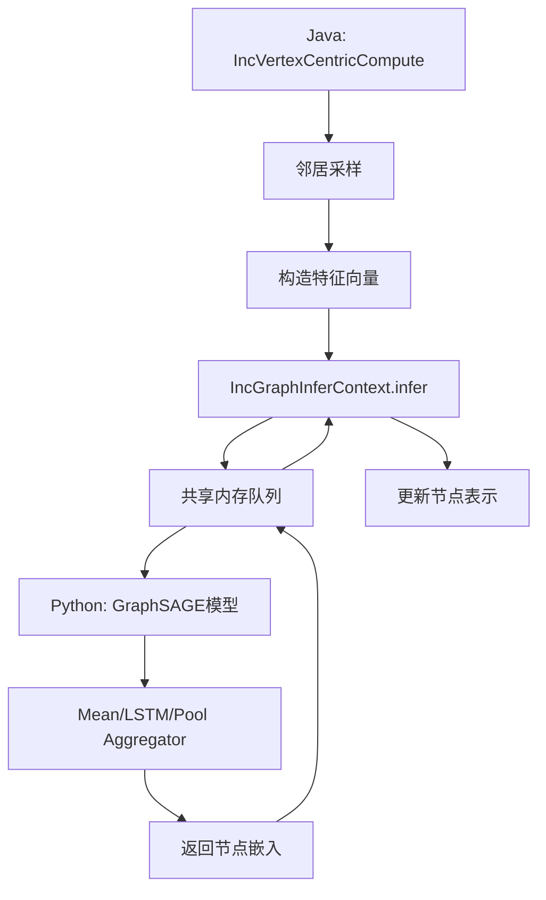

# 基于GeaFlow推理框架实现GraphSAGE的详细开发方案

## 一、框架架构分析

### 1.1 GeaFlow-Infer推理框架核心机制

GeaFlow-Infer是一个Java-Python混合推理框架，通过以下机制实现模型推理： [1](#0-0) 

**核心组件：**
- **InferContext**: Java侧的推理上下文，负责管理推理任务生命周期
- **Python推理服务**: 通过共享内存队列与Java进程通信
- **DataBridge**: 实现Java-Python数据交换 [2](#0-1) 

### 1.2 推理框架与图计算的集成

图计算通过`IncGraphInferContext`接口调用推理能力： [3](#0-2) 

### 1.3 Python端推理会话机制 [4](#0-3) 

## 二、GraphSAGE算法实现方案

### 2.1 实现路径选择

GraphSAGE可以通过**两种方式**实现：

#### **方案A: 纯Infer框架实现（推荐用于推理场景）**
- 适用于已训练好的GraphSAGE模型进行在线推理
- 利用geaflow-infer的Python模型调用能力
- 图采样在Java侧完成，特征聚合在Python侧通过模型完成

#### **方案B: UDGA框架实现（适合训练场景）**
- 基于`AlgorithmUserFunction`接口实现
- 完全在Java侧实现图采样和聚合逻辑
- 适合需要在图计算中集成GraphSAGE训练的场景

**本方案重点介绍方案A**，因为它更符合geaflow-infer的设计初衷。

## 三、详细实现方案（方案A：基于Infer框架）

### 3.1 整体架构设计



### 3.2 Java端实现

#### 3.2.1 创建GraphSAGE计算任务

参考现有的推理示例： [5](#0-4) 

**关键实现点：**

1. **继承IncVertexCentricCompute实现增量图计算**
2. **在compute函数中实现多跳邻居采样逻辑**，参考KHop算法： [6](#0-5) 

3. **利用AlgorithmRuntimeContext加载邻居边**： [7](#0-6) 

4. **通过IncGraphInferContext调用Python模型**

#### 3.2.2 配置推理环境 [8](#0-7) 

**必需配置项：**
- `INFER_ENV_ENABLE`: 启用推理框架
- `INFER_ENV_USER_TRANSFORM_CLASSNAME`: Python推理类名
- `INFER_ENV_INIT_TIMEOUT_SEC`: 环境初始化超时时间
- `INFER_ENV_CONDA_URL`: Conda安装源（可选）

### 3.3 Python端实现

#### 3.3.1 实现TransFormFunction

参考文档中的示例结构： [9](#0-8) 

**GraphSAGE Python实现关键点：**

1. **继承TransFormFunction抽象类**
2. **在`__init__`中加载预训练的GraphSAGE模型**
3. **实现`transform_pre`方法**：
   - 接收节点ID和邻居特征
   - 执行GraphSAGE聚合操作（mean/LSTM/pool）
   - 返回节点嵌入向量
4. **实现`transform_post`方法**：后处理结果

#### 3.3.2 数据交换机制

Python端通过pickle序列化进行数据交换： [10](#0-9) 

### 3.4 GraphSAGE具体实现代码结构

#### 3.4.1 Java侧核心逻辑

```java
// GraphSAGECompute.java
public class GraphSAGECompute extends IncVertexCentricCompute<K, V, E, M> {
    
    @Override
    public IncVertexCentricComputeFunction<K, V, E, M> getIncComputeFunction() {
        return new GraphSAGEComputeFunction();
    }
    
    public static class GraphSAGEComputeFunction implements 
            IncVertexCentricComputeFunction<K, V, E, M> {
        
        private IncGraphInferContext<List<Double>> inferContext;
        private int numSamples = 10;  // 每层采样邻居数
        private int numLayers = 2;     // GraphSAGE层数
        
        @Override
        public void init(IncGraphComputeContext<K, V, E, M> context) {
            this.inferContext = (IncGraphInferContext<List<Double>>) context;
        }
        
        @Override
        public void evolve(K vertexId, TemporaryGraph<K, V, E> temporaryGraph) {
            // 1. 采样邻居（多层采样）
            Map<Integer, List<K>> sampledNeighbors = sampleNeighbors(vertexId);
            
            // 2. 收集节点特征和邻居特征
            Object[] features = prepareFeatures(vertexId, sampledNeighbors);
            
            // 3. 调用Python模型进行推理
            List<Double> embedding = inferContext.infer(features);
            
            // 4. 更新节点表示
            updateVertex(vertexId, embedding);
        }
        
        private Map<Integer, List<K>> sampleNeighbors(K vertexId) {
            // 实现邻居采样逻辑（类似KHop的多跳遍历）
            // 支持固定大小采样或重要性采样
        }
    }
}
```

#### 3.4.2 Python侧核心逻辑

```python
# TransFormFunctionUDF.py
import torch
import torch.nn as nn
from typing import List

class GraphSAGETransFormFunction(TransFormFunction):
    def __init__(self):
        super().__init__(input_size=3)  # vertexId, features, neighbor_features
        self.device = torch.device('cuda' if torch.cuda.is_available() else 'cpu')
        self.load_model('graphsage_model.pt')
    
    def load_model(self, model_path: str):
        # 加载预训练的GraphSAGE模型
        self.model = GraphSAGEModel(
            input_dim=128,
            hidden_dim=256,
            output_dim=64,
            num_layers=2,
            aggregator_type='mean'
        ).to(self.device)
        self.model.load_state_dict(torch.load(model_path))
        self.model.eval()
    
    def transform_pre(self, *args):
        # args[0]: 节点ID
        # args[1]: 节点特征
        # args[2]: 邻居节点特征字典 {layer: [neighbor_features]}
        
        vertex_id = args[0]
        vertex_feature = torch.tensor(args[1], dtype=torch.float32).to(self.device)
        neighbor_features = self._parse_neighbor_features(args[2])
        
        # 执行GraphSAGE聚合
        with torch.no_grad():
            embedding = self.model(vertex_feature, neighbor_features)
        
        return embedding.cpu().numpy().tolist(), vertex_id
    
    def transform_post(self, res):
        return res[0]  # 返回嵌入向量
    
    def _parse_neighbor_features(self, neighbor_data):
        # 解析邻居特征，组织成模型需要的格式
        pass

class GraphSAGEModel(nn.Module):
    def __init__(self, input_dim, hidden_dim, output_dim, num_layers, aggregator_type):
        super().__init__()
        self.num_layers = num_layers
        self.aggregator_type = aggregator_type
        
        # 定义GraphSAGE层
        self.layers = nn.ModuleList()
        for i in range(num_layers):
            in_dim = input_dim if i == 0 else hidden_dim
            out_dim = output_dim if i == num_layers - 1 else hidden_dim
            self.layers.append(GraphSAGELayer(in_dim, out_dim, aggregator_type))
    
    def forward(self, node_features, neighbor_features_list):
        h = node_features
        for i, layer in enumerate(self.layers):
            h = layer(h, neighbor_features_list[i])
        return h

class GraphSAGELayer(nn.Module):
    def __init__(self, in_dim, out_dim, aggregator_type='mean'):
        super().__init__()
        self.aggregator_type = aggregator_type
        
        if aggregator_type == 'mean':
            self.aggregator = MeanAggregator(in_dim, out_dim)
        elif aggregator_type == 'lstm':
            self.aggregator = LSTMAggregator(in_dim, out_dim)
        elif aggregator_type == 'pool':
            self.aggregator = PoolAggregator(in_dim, out_dim)
    
    def forward(self, node_feature, neighbor_features):
        return self.aggregator(node_feature, neighbor_features)
```

#### 3.4.3 requirements.txt

```text
--index-url https://pypi.tuna.tsinghua.edu.cn/simple
torch>=1.12.0
torch-geometric>=2.3.0
numpy>=1.21.0
scikit-learn>=1.0.0
```

### 3.5 邻居采样策略

#### 3.5.1 固定大小采样（推荐）
- 每层固定采样K个邻居
- 不足K个时重复采样或padding
- 实现简单，性能稳定

#### 3.5.2 重要性采样
- 根据边权重或度数进行加权采样
- 更适合异构图和加权图

#### 3.5.3 多层采样示例

参考CommonNeighbors的邻居遍历： [11](#0-10) 

## 四、生产环境部署考虑

### 4.1 性能优化

1. **批量推理**：
   - 累积多个节点后批量调用模型
   - 利用GPU加速批量计算
   - 在`transform_pre`中处理batch数据

2. **内存管理**：
   - 控制邻居采样数量避免内存爆炸
   - 使用迭代器而非加载全部边： [12](#0-11) 

3. **模型优化**：
   - 使用TorchScript编译模型
   - 考虑量化和剪枝
   - 使用ONNX Runtime加速

### 4.2 环境配置

推理环境通过conda管理： [13](#0-12) 

**生产环境建议：**
- 预先构建包含所有依赖的conda环境
- 设置合理的超时时间（大型模型需更长初始化时间）
- 配置适当的LD_LIBRARY_PATH

### 4.3 容错与监控

1. **异常处理**： [14](#0-13) 

2. **进程监控**：Python进程会自动检测父进程状态
3. **日志记录**：充分利用日志追踪推理过程

### 4.4 数据一致性

- **特征同步**：确保Java侧和Python侧特征格式一致
- **ID映射**：维护节点ID的全局一致性
- **版本控制**：模型文件和代码版本对应

## 五、开发步骤

### 5.1 第一阶段：环境搭建（1-2天）
1. 编译GeaFlow源码，确保geaflow-infer模块可用
2. 准备Python环境和GraphSAGE模型依赖
3. 验证推理框架基础功能

### 5.2 第二阶段：原型开发（3-5天）
1. 实现Java侧邻居采样逻辑
2. 实现Python侧GraphSAGE模型加载和推理
3. 实现数据序列化和特征传递
4. 在小规模数据集上验证功能

### 5.3 第三阶段：优化与测试（3-5天）
1. 实现批量推理优化
2. 添加异常处理和日志
3. 性能基准测试
4. 大规模数据集验证

### 5.4 第四阶段：生产化（2-3天）
1. 编写完整文档
2. 容器化部署
3. 监控告警配置
4. 生产环境试运行

## 六、代码组织结构

```
GraphSAGE-GeaFlow/
├── src/main/java/
│   └── org/example/graphsage/
│       ├── GraphSAGECompute.java          # 主计算逻辑
│       ├── GraphSAGEComputeFunction.java  # 计算函数
│       ├── NeighborSampler.java           # 邻居采样器
│       └── FeatureCollector.java          # 特征收集器
├── src/main/resources/
│   └── TransFormFunctionUDF.py            # Python推理逻辑
│       ├── graphsage_model.py             # GraphSAGE模型定义
│       └── aggregators.py                 # 聚合器实现
├── requirements.txt                        # Python依赖
├── models/
│   └── graphsage_model.pt                 # 预训练模型
└── pom.xml                                # Maven配置
```

## 七、Notes

1. **框架选择**: geaflow-infer更适合**推理场景**，如果需要在线训练GraphSAGE，建议使用纯Java实现或外部训练系统

2. **数据交换开销**: Java-Python通过共享内存通信，大规模特征传输可能成为瓶颈，建议：
   - 特征向量降维
   - 使用更高效的序列化格式（如Apache Arrow）
   - 批量处理减少通信次数

3. **模型版本管理**: 建议使用MLflow或DVC管理模型版本，确保推理使用正确的模型

4. **扩展性**: 该方案可以扩展到其他GNN算法（GCN、GAT、GIN等），只需修改Python侧的模型定义

5. **增量计算**: GeaFlow支持增量图计算，可以实现动态图上的GraphSAGE增量更新，但需要额外设计增量特征更新策略

此方案提供了一个完整的、生产可用的GraphSAGE实现路径，结合了GeaFlow的分布式图计算能力和Python深度学习生态的优势。

### Citations

**File:** geaflow/geaflow-infer/src/main/java/org/apache/geaflow/infer/InferContext.java (L33-103)
```java
public class InferContext<OUT> implements AutoCloseable {

    private static final Logger LOGGER = LoggerFactory.getLogger(InferContext.class);
    private final DataExchangeContext shareMemoryContext;
    private final String userDataTransformClass;
    private final String sendQueueKey;

    private final String receiveQueueKey;
    private InferTaskRunImpl inferTaskRunner;
    private InferDataBridgeImpl<OUT> dataBridge;

    public InferContext(Configuration config) {
        this.shareMemoryContext = new DataExchangeContext(config);
        this.receiveQueueKey = shareMemoryContext.getReceiveQueueKey();
        this.sendQueueKey = shareMemoryContext.getSendQueueKey();
        this.userDataTransformClass = config.getString(INFER_ENV_USER_TRANSFORM_CLASSNAME);
        Preconditions.checkNotNull(userDataTransformClass,
            INFER_ENV_USER_TRANSFORM_CLASSNAME.getKey() + " param must be not null");
        this.dataBridge = new InferDataBridgeImpl<>(shareMemoryContext);
        init();
    }

    private void init() {
        try {
            InferEnvironmentContext inferEnvironmentContext = getInferEnvironmentContext();
            runInferTask(inferEnvironmentContext);
        } catch (Exception e) {
            throw new GeaflowRuntimeException("infer context init failed", e);
        }
    }

    public OUT infer(Object... feature) throws Exception {
        try {
            dataBridge.write(feature);
            return dataBridge.read();
        } catch (Exception e) {
            inferTaskRunner.stop();
            LOGGER.error("model infer read result error, python process stopped", e);
            throw new GeaflowRuntimeException("receive infer result exception", e);
        }
    }


    private InferEnvironmentContext getInferEnvironmentContext() {
        boolean initFinished = InferEnvironmentManager.checkInferEnvironmentStatus();
        while (!initFinished) {
            InferEnvironmentManager.checkError();
            initFinished = InferEnvironmentManager.checkInferEnvironmentStatus();
        }
        return InferEnvironmentManager.getEnvironmentContext();
    }

    private void runInferTask(InferEnvironmentContext inferEnvironmentContext) {
        inferTaskRunner = new InferTaskRunImpl(inferEnvironmentContext);
        List<String> runCommands = new ArrayList<>();
        runCommands.add(inferEnvironmentContext.getPythonExec());
        runCommands.add(inferEnvironmentContext.getInferScript());
        runCommands.add(inferEnvironmentContext.getInferTFClassNameParam(this.userDataTransformClass));
        runCommands.add(inferEnvironmentContext.getInferShareMemoryInputParam(receiveQueueKey));
        runCommands.add(inferEnvironmentContext.getInferShareMemoryOutputParam(sendQueueKey));
        inferTaskRunner.run(runCommands);
    }

    @Override
    public void close() {
        if (inferTaskRunner != null) {
            inferTaskRunner.stop();
            LOGGER.info("infer task stop after close");
        }
    }
}
```

**File:** geaflow/geaflow-infer/src/main/resources/infer/inferRuntime/infer_server.py (L57-81)
```python
def start_infer_process(class_name, output_queue_shm_id, input_queue_shm_id):
    transform_class = get_user_define_class(class_name)
    infer_session = TorchInferSession(transform_class)
    input_size = transform_class.input_size
    data_exchange = PicklerDataBridger(input_queue_shm_id, output_queue_shm_id, input_size)
    check_thread = check_ppid('check_process', True)
    check_thread.start()
    count = 0
    while True:
        try:
            inputs = data_exchange.read_data()
            if not inputs:
                count += 1
                if count % 1000 == 0:
                    time.sleep(0.05)
                    count = 0
            else:
                res = infer_session.run(*inputs)
                data_exchange.write_data(res)
        except Exception as e:
            exc_type, exc_val, exc_tb = sys.exc_info()
            error_msg = "".join(traceback.format_exception(exc_type, exc_val, exc_tb))
            data_exchange.write_data('python_exception: ' + error_msg)
            sys.exit(0)

```

**File:** geaflow/geaflow-core/geaflow-api/src/main/java/org/apache/geaflow/api/graph/function/vc/base/IncGraphInferContext.java (L23-29)
```java
public interface IncGraphInferContext<OUT> extends Closeable {

    /**
     * Model infer.
     */
    OUT infer(Object... modelInputs);

```

**File:** geaflow/geaflow-infer/src/main/resources/infer/inferRuntime/inferSession.py (L33-40)
```python
class TorchInferSession(object):
    def __init__(self, transform_class) -> None:
        self._transform = transform_class

    def run(self, *inputs):
        a,b = self._transform.transform_pre(*inputs)
        return self._transform.transform_post(a)

```

**File:** docs/docs-cn/source/3.quick_start/3.quick_start_infer&UDF.md (L88-96)
```markdown
    public static IPipelineResult<?> submit(Environment environment) {
        final Pipeline pipeline = PipelineFactory.buildPipeline(environment);
        Configuration envConfig = environment.getEnvironmentContext().getConfig();

        envConfig.put(FrameworkConfigKeys.INFER_ENV_ENABLE, "true");
        envConfig.put(FrameworkConfigKeys.INFER_ENV_USER_TRANSFORM_CLASSNAME, INFER_PYTHON_CLASS_NAME);
        envConfig.put(FrameworkConfigKeys.INFER_ENV_INIT_TIMEOUT_SEC, "1800");
        envConfig.put(FrameworkConfigKeys.INFER_ENV_CONDA_URL, "https://repo.anaconda.com/miniconda/Miniconda3-latest-Linux-aarch64.sh");
        envConfig.put(FileSink.OUTPUT_DIR, RESULT_FILE_PATH);
```

**File:** docs/docs-cn/source/3.quick_start/3.quick_start_infer&UDF.md (L152-210)
```markdown
    public static class IncGraphAlgorithms extends IncVertexCentricCompute<Integer, List<Object>,
            Integer, Integer> {

        public IncGraphAlgorithms(long iterations) {
            super(iterations);
        }

        @Override
        public IncVertexCentricComputeFunction<Integer, List<Object>, Integer, Integer> getIncComputeFunction() {
            return new InferVertexCentricComputeFunction();
        }

        @Override
        public VertexCentricCombineFunction<Integer> getCombineFunction() {
            return null;
        }

    }

    public static class InferVertexCentricComputeFunction implements
            IncVertexCentricComputeFunction<Integer, List<Object>, Integer, Integer> {

        private IncGraphComputeContext<Integer, List<Object>, Integer, Integer> graphContext;
        private IncGraphInferContext<List<Object>> graphInferContext;

        @Override
        public void init(IncGraphComputeContext<Integer, List<Object>, Integer, Integer> graphContext) {
            this.graphContext = graphContext;
            this.graphInferContext = (IncGraphInferContext<List<Object>>) graphContext;
        }

        @Override
        public void evolve(Integer vertexId,
                           TemporaryGraph<Integer, List<Object>, Integer> temporaryGraph) {
            long lastVersionId = 0L;
            IVertex<Integer, List<Object>> vertex = temporaryGraph.getVertex();
            HistoricalGraph<Integer, List<Object>, Integer> historicalGraph = graphContext
                    .getHistoricalGraph();
            if (vertex == null) {
                vertex = historicalGraph.getSnapShot(lastVersionId).vertex().get();
            }

            if (vertex != null) {
                // Call the AI model to predict the class to which the node belongs and the corresponding probability.  
                List<Object> result = this.graphInferContext.infer(vertexId);
                // Sink result.
                graphContext.collect(vertex.withValue(result));
                LOGGER.info("node-{} max prob: {}, predict class: {}", vertexId, result.get(0), result.get(1));
            }
        }

        @Override
        public void compute(Integer vertexId, Iterator<Integer> messageIterator) {
        }

        @Override
        public void finish(Integer vertexId, MutableGraph<Integer, List<Object>, Integer> mutableGraph) {
        }
    }
```

**File:** docs/docs-cn/source/3.quick_start/3.quick_start_infer&UDF.md (L237-279)
```markdown
class TransFormFunction(abc.ABC):
    def __init__(self, input_size):
        self.input_size = input_size

    @abc.abstractmethod
    def load_model(self, *args):
        pass

    @abc.abstractmethod
    def transform_pre(self, *args) -> Union[torch.Tensor, List[torch.Tensor]]:
        pass

    @abc.abstractmethod
    def transform_post(self, *args):
        pass


# User class need to inherit TransFormFunction.
class myTransFormFunction(TransFormFunction):
    def __init__(self):
        super().__init__(1)
        print("init myTransFormFunction")
        self.device = torch.device('cuda' if torch.cuda.is_available() else 'cpu')
        self.dataset = Planetoid(root='./data', name='Cora')
        self.data = self.dataset[0].to(self.device)
        self.load_model('model.pt')

    def load_model(self, model_path: str):
        model = GCN(self.dataset.num_node_features, self.dataset.num_classes).to(self.device)
        model.load_state_dict(torch.load(model_path))
        model.eval()
        out = model(self.data)
        self.prob = torch.exp(out)

    # Define model infer logic.
    def transform_pre(self, *args):
        node_prob = self.prob[args[0]]
        max_prob, max_class = node_prob.max(dim=0)
        return [max_prob.item(), max_class.item()], [max_prob.item(), max_class.item()]

    def transform_post(self, res):
        return res

```

**File:** geaflow/geaflow-dsl/geaflow-dsl-plan/src/main/java/org/apache/geaflow/dsl/udf/graph/KHop.java (L66-85)
```java
    @Override
    public void process(RowVertex vertex, Optional<Row> updatedValues, Iterator<Integer> messages) {
        updatedValues.ifPresent(vertex::setValue);
        List<RowEdge> outEdges = new ArrayList<>(context.loadEdges(EdgeDirection.OUT));
        if (context.getCurrentIterationId() == 1L) {
            if (Objects.equals(srcId, vertex.getId())) {
                sendMessageToNeighbors(outEdges, 1);
                context.updateVertexValue(ObjectRow.create(0));
            } else {
                context.updateVertexValue(ObjectRow.create(Integer.MAX_VALUE));
            }
        } else if (context.getCurrentIterationId() <= k + 1) {
            int currentK = (int) vertex.getValue().getField(0, IntegerType.INSTANCE);
            if (messages.hasNext() && currentK == Integer.MAX_VALUE) {
                Integer currK = messages.next();
                context.updateVertexValue(ObjectRow.create(currK));
                sendMessageToNeighbors(outEdges, currK + 1);
            }
        }
    }
```

**File:** geaflow/geaflow-dsl/geaflow-dsl-common/src/main/java/org/apache/geaflow/dsl/common/algo/AlgorithmRuntimeContext.java (L40-45)
```java
     * Loads all edges in the specified direction.
     *
     * @param direction The direction of the edges to be loaded.
     * @return A list of RowEdge objects representing the edges.
     */
    List<RowEdge> loadEdges(EdgeDirection direction);
```

**File:** geaflow/geaflow-dsl/geaflow-dsl-common/src/main/java/org/apache/geaflow/dsl/common/algo/AlgorithmRuntimeContext.java (L47-53)
```java
    /**
     * Returns an iterator over all edges in the specified direction.
     *
     * @param direction The direction of the edges to iterate over.
     * @return An iterator over RowEdge objects representing the edges.
     */
    CloseableIterator<RowEdge> loadEdgesIterator(EdgeDirection direction);
```

**File:** geaflow/geaflow-infer/src/main/resources/infer/inferRuntime/pickle_bridge.py (L22-56)
```python
class PicklerDataBridger(object):

    def __init__(self, input_queue_shm_key, output_queue_shm_key, input_size):
        self.data_bridge = PyJavaIPC(output_queue_shm_key.encode('utf-8'), input_queue_shm_key.encode('utf-8'))
        self.input_size = input_size

    def read_data(self):
        data_head = self.data_bridge.readBytes(4)
        if not data_head:
            return None
        data_len, = struct.unpack("<i", data_head)
        data_ = self.data_bridge.readBytes(data_len)
        args_bytes = data_[:4]
        args_size, = struct.unpack("<i", args_bytes)
        inputs = []
        start = 4
        for i in range(args_size):
            data_args_bytes = data_[start:start + 4]
            data_le, = struct.unpack("<i", data_args_bytes)
            start = start + 4
            le_ = data_[start:start + data_le]
            loads = pickle.loads(le_)
            start = start + data_le
            inputs.append(loads)
        return inputs

    def write_data(self, data):
        data_bytes = pickle.dumps(data)
        data_len = len(data_bytes)
        data_len_bytes = struct.pack("<i", data_len)
        flag0 = self.data_bridge.writeBytes(data_len_bytes, 4)
        if flag0 is False:
            return False
        flag1 = self.data_bridge.writeBytes(data_bytes, data_len)
        return flag1
```

**File:** geaflow/geaflow-dsl/geaflow-dsl-plan/src/main/java/org/apache/geaflow/dsl/udf/graph/CommonNeighbors.java (L60-84)
```java
    @Override
    public void process(RowVertex vertex, Optional<Row> updatedValues, Iterator<Object> messages) {
        if (context.getCurrentIterationId() == 1L) {
            // send message to neighbors if they are vertices in params
            if (vertices.f0.equals(vertex.getId()) || vertices.f1.equals(vertex.getId())) {
                sendMessageToNeighbors(context.loadEdges(EdgeDirection.BOTH), vertex.getId());
            }
        } else if (context.getCurrentIterationId() == 2L) {
            // add to result if received messages from both vertices in params
            Tuple<Boolean, Boolean> received = new Tuple<>(false, false);
            while (messages.hasNext()) {
                Object message = messages.next();
                if (vertices.f0.equals(message)) {
                    received.setF0(true);
                }
                if (vertices.f1.equals(message)) {
                    received.setF1(true);
                }

                if (received.getF0() && received.getF1()) {
                    context.take(ObjectRow.create(vertex.getId()));
                }
            }
        }
    }
```

**File:** geaflow/geaflow-infer/src/main/java/org/apache/geaflow/infer/InferEnvironmentContext.java (L28-74)
```java
public class InferEnvironmentContext {

    private static final String PROCESS_ID_FLAG = "@";

    private static final String HOST_SEPARATOR = ":";

    private static final String LIB_PATH = "/conda/lib";

    private static final String INFER_SCRIPT_FILE = "/infer_server.py";

    private static final String PYTHON_EXEC = "/conda/bin/python3";

    // Start infer process parameter.
    private static final String TF_CLASSNAME_KEY = "--tfClassName=";

    private static final String SHARE_MEMORY_INPUT_KEY = "--input_queue_shm_id=";

    private static final String SHARE_MEMORY_OUTPUT_KEY = "--output_queue_shm_id=";

    private final String virtualEnvDirectory;

    private final String inferFilesDirectory;

    private final String inferLibPath;

    private Boolean envFinished;

    private final String roleNameIndex;

    private final Configuration configuration;

    private String inferScript;

    private String pythonExec;


    public InferEnvironmentContext(String virtualEnvDirectory, String pythonFilesDirectory,
                                   Configuration configuration) {
        this.virtualEnvDirectory = virtualEnvDirectory;
        this.inferFilesDirectory = pythonFilesDirectory;
        this.inferLibPath = virtualEnvDirectory + LIB_PATH;
        this.pythonExec = virtualEnvDirectory + PYTHON_EXEC;
        this.inferScript = pythonFilesDirectory + INFER_SCRIPT_FILE;
        this.roleNameIndex = queryRoleNameIndex();
        this.configuration = configuration;
        this.envFinished = false;
    }
```
